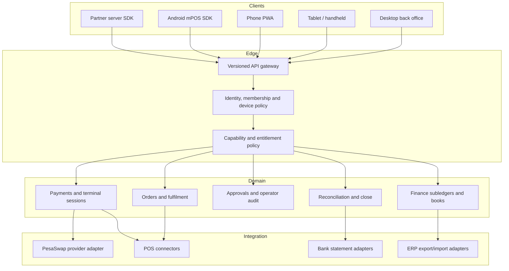

# Global enterprise platform roadmap

## Purpose

Move PesaSwap Merchant from a strong Kenya-first merchant application to a
globally deployable commerce and operations platform with controls comparable to
enterprise ERP suites. This is a target architecture and delivery contract, not
a claim of SAP, Oracle, PCI, EMV, WCAG, or regulatory certification.

Every item is complete only when its acceptance criteria pass on development,
prod-local, sandbox, and production with the required migrations applied.

## Current baseline

| Domain                    | Current position                                                          | Enterprise verdict                                                         |
| ------------------------- | ------------------------------------------------------------------------- | -------------------------------------------------------------------------- |
| Tenant and role isolation | Venue claims, central route policy, per-store roles, capability catalogue | Strong base; manager membership is not yet authoritative for every request |
| Commerce                  | Server-bound orders, payments, refunds, invoices, QR, KDS                 | Strong regional core; lifecycle and partner contracts are not frozen       |
| Accounting                | Balanced minor-unit journals, AR, COGS, tips, periods, audit checkpoints  | Credible subledger; not a global legal-entity GL                           |
| Reconciliation            | Internal settlement estimates and provider-reference matching             | Partial; unauthenticated evidence must never create bank cash              |
| Operations                | Orders, tables, shifts, staff, reports and floor views                    | Partial; no coherent approval or End-of-Service control plane              |
| Productisation            | Server-side vertical, tier and capability catalogue                       | Good foundation; enforcement is not yet universal                          |
| Partner integration       | POS connector contract, Toast adapter, A2A and curated OpenAPI            | Partial; no generation-grade partner API or public SDK                     |
| Devices                   | Responsive PWA, mobile operator app, push and offline drafts              | Partial; no managed device identity or Android mPOS SDK                    |
| Accessibility             | Static JSX accessibility lint ratchet                                     | Partial; no axe, contrast, keyboard or screen-reader certification         |
| Globalisation             | Venue timezone and minor-unit accounting                                  | Gap; KES-first finance, no locale/tax/legal-entity model                   |

## Enterprise invariants

These rules apply to every phase:

1. The authenticated principal, membership and capability profile are the only
   sources of authority. Request bodies and query parameters never grant scope.
2. Money is signed `int64` minor units with ISO 4217 currency and explicit
   exponent. Floating-point money is forbidden at every public boundary.
3. Every mutation is idempotent, tenant-pinned, attributable and observable.
4. Financial and approval facts are append-only. Corrections are reversals, not
   edits.
5. Maker and checker are different humans wherever configured thresholds require
   approval.
6. A client success state is advisory. Server retrieval and verified provider or
   bank evidence are authoritative.
7. Navigation is UX. API and data policy are security and always fail closed.
8. Offline mode may draft work but never silently moves money or invents server
   truth.
9. Public API majors are immutable. Breaking auth, money, state or error changes
   require a new major and a published migration window.
10. No compliance claim is made until an independent test programme produces
    evidence.

## Target architecture



## Phase 0: authority, approvals and audit

**Goal:** make authority revocable, explainable and safe enough to support every
later enterprise workflow.

### P0.1 Authoritative membership

**Source status:** implemented on 2026-08-24; migration 82 and all-tier runtime
verification remain deployment gates.

- Resolve the current venue role from `user_venues`, not a stale `app_users`
  primary-role snapshot.
- Add membership versioning to JWTs and validate it on protected venue requests.
- Re-role or removal revokes existing sessions immediately.
- Only a venue owner may grant, re-role or remove a manager.
- Preserve independent roles for the same person at different venues.

**Acceptance:** a demoted manager's existing token receives `401` or `403`
immediately; re-login cannot restore the former role; another venue is unchanged.

### P0.2 Approval kernel

- Add reusable approval policies, requests, decisions and execution records.
- Support amount thresholds, action scopes, expiry, escalation and substitute
  approvers.
- Enforce requester != approver and prevent self-approval.
- Apply first to refunds, comps/discounts, voids, shift corrections, payout
  evidence, tip payouts and manual journals.

**Acceptance:** every controlled command is pending, approved, rejected, expired
or executed exactly once; execution cannot exceed the approved snapshot.

### P0.3 Operator event stream

- Append principal, effective role, venue, action, object, before/after snapshot,
  reason, approval ID, request ID, client source/version and timestamp.
- Hash-chain or externally anchor export checkpoints.
- Provide tenant-scoped search and signed export manifests.

**Exit gate:** no privileged venue mutation exists without current membership,
capability, audit identity and approval enforcement where configured.

## Phase 1: server-authoritative operations and End of Service

### P1.1 Order and floor integrity

- Derive totals from authoritative catalogue rows.
- Enforce a forward order state machine and paid-order rules.
- Persist assignments, sections, transfers, hold/fire, cancellation reasons and
  manager overrides as order events.
- Remove localStorage fallback authority from KDS and floor status.

### P1.2 Workforce operations

- Persist schedules, punches, breaks, corrections, pay rates and overtime.
- Link operational staff, login membership and POS cashier identity explicitly.
- Provide manager labour, performance and exception views.

### P1.3 End of Service

- Aggregate QR, terminal, link, cash and POS tenders by business day, service and
  revenue centre.
- Block close on active tickets, unresolved walkouts, pending/failed payments,
  unapproved refunds, open shifts, undistributed tips and POS push failures.
- Run discrepancy analysis asynchronously and persist the report.
- Export a line-level accountant package with freshness and evidence status.

**Exit gate:** a manager can close a service in under five minutes with zero
unexplained difference, and an accountant can review it later without email.

## Phase 2: global finance and reconciliation

### P2.1 Legal entities and books

- Separate registered legal entities from operational venues and reseller orgs.
- Model country, registrations, functional currency, fiscal calendar, books and
  effective-dated venue mappings.
- Add configurable chart hierarchy and validated dimensions: company, venue,
  cost centre, profit centre, product, channel, customer, tax and project.

### P2.2 Currency and tax

- Store transaction, functional and reporting currency amounts with sourced FX
  rates and timestamps.
- Support realized/unrealized FX, revaluation and consolidation translation.
- Add effective-dated tax codes, jurisdictions, inclusive/exclusive tax,
  withholding, exemptions and filing reconciliation.

### P2.3 Bank-grade reconciliation

- Stage provider evidence as unverified; it cannot post bank cash.
- Import immutable authenticated bank statement lines with duplicate detection.
- Support exact, one-to-many and many-to-one matching, suspense and owned
  exceptions.
- Require independent bank match and approval before posting settled bank.

### P2.4 Close governance and ERP interoperability

- Add open, soft-close and hard-close states with sequential period gates.
- Gate close on subledgers, provider/bank, tax, FX and outbox completeness.
- Publish signed journal/export runs for SAP, Oracle and standard bank/tax formats
  without making either ERP the internal source of truth.

**Exit gate:** one complete multi-currency period closes, reopens under approval,
recloses and exports with a signed manifest and zero unexplained difference.

## Phase 3: versioned partner API and Android mPOS

### P3.1 Public API contract

- Freeze `/api/v1` DTOs independently from internal handlers.
- Require operation IDs, typed errors, security, examples, callbacks, request IDs
  and compatibility tests in OpenAPI.
- Scope idempotency by partner, venue, operation and key with a request hash.
- Same key/same input replays; changed input returns `409`; database uncertainty
  never proceeds to a provider.

Initial server SDK surface:

- `paymentSessions.create`
- `payments.retrieve`, `capture`, `cancel`
- `refunds.create`, `retrieve`
- `paymentMethods.list`, `setDefault`, `detach`
- `webhooks.verify`

### P3.2 Managed device identity

- Enrol devices using a one-time owner/manager pairing code.
- Store tenant, store, device class, platform, key fingerprint, attestation state,
  app version, capabilities, last seen and revocation.
- Issue short-lived device tokens bound to the enrolled public key and venue.
- Support remote revoke, minimum-version policy and audit-visible health.

### P3.3 Terminal session protocol

- Keep card-present separate from restaurant POS tender connectors.
- Model terminal sessions with amount, currency, order/check reference,
  idempotency, device, operator, state version and monotonic event sequence.
- Support create, collect, customer action, cancel, recover, complete and unknown
  outcomes with authoritative server callbacks.
- Never accept PAN, PIN or track data into Merchant APIs or logs.

### P3.4 Kotlin SDK

Publish modules with independent SemVer:

```text
pesaswap-core        HTTP, auth, errors, money, request IDs
pesaswap-checkout    M-Pesa/card-not-present payment sessions
pesaswap-terminal    certified provider bridge only
pesaswap-receipts    receipt/share/print abstractions
pesaswap-testing     simulator and contract fixtures
```

The Android SDK must provide coroutine APIs, sealed unknown-safe results,
process-death recovery, encrypted local state, network retry policy, ProGuard
rules, a sample app and generated contract tests. A card-not-present Android SDK
must never be marketed as mPOS. Card-present ships only with a certified EMV/PCI
MPoC/CPoC provider boundary.

**Exit gate:** an enrolled Android handheld creates and recovers a sandbox
terminal/payment session, prints or shares a receipt, survives process death and
network loss, and never handles raw card data.

## Phase 4: global UX across devices

### P4.1 Adaptive device shells

**Source status:** first responsive foundation implemented on 2026-08-24;
desktop, Android handheld and Android tablet browser profiles pass. Split-pane
operations and native peripheral support remain open.

- Desktop: dense comparison, bulk action and keyboard workflows.
- Tablet/handheld: landscape and portrait split-pane operation with 44-48px touch
  targets and no fixed phone-width shell.
- Phone: single-task flows, safe-area support and offline recovery.
- Customer display/terminal: minimal locked task surface with no back-office data.

### P4.2 Accessibility

- Eliminate pointer-only controls and unassociated labels.
- Add named dialogs, focus trap/return, Escape behavior and live announcements for
  every financial and order outcome.
- Add axe, contrast, keyboard, zoom/reflow and Android tablet projects to CI.
- Complete manual NVDA, VoiceOver and TalkBack testing before any WCAG claim.

### P4.3 Localisation

- Add venue locale, language, numbering, date/time, timezone and currency display
  policy.
- Format every operational timestamp in venue time and show the zone where
  ambiguity matters.
- Externalise strings and support RTL before declaring global language support.

### P4.4 Offline and updates

- Keep financial actions online-authoritative.
- Make drafts inspectable, retryable and discardable with explicit expiry.
- Never cache sensitive navigations; provide forced minimum-version updates for
  managed devices.

**Exit gate:** the critical owner, manager, staff and guest journeys pass at
320x568, 430x932, 768x1024, 1280x720 and managed Android handheld profiles with
no overflow, unnamed control or stale sensitive state.

## Phase 5: enterprise operations and certification

- Structured audit logs, traces and metrics keyed by request, tenant, operation,
  payment, order, device and connector.
- SLOs for payment create/status, KDS propagation, terminal recovery, webhook lag,
  reconciliation freshness and close completion.
- Multi-region recovery, tested backups, RPO/RTO, key rotation, data residency,
  retention and privacy workflows.
- Connector certification matrix, version policy, contract fixtures and canary
  rollouts.
- Performance, concurrency, chaos, security and penetration testing.
- Evidence packs for PCI scope, privacy, accessibility and applicable local
  payment/fiscal regulation.

**Final exit gate:** every core journey passes against production-equivalent data
on desktop, phone, tablet/handheld and Android SDK; all financial postings and
approvals reconcile; rollback and disaster recovery are demonstrated; no P0/P1
finding remains open.

## Delivery order

| Order | Work package                                              | Why it comes now                                                          |
| ----- | --------------------------------------------------------- | ------------------------------------------------------------------------- |
| 1     | Authoritative membership and revocation                   | Every approval and device token depends on current authority              |
| 2     | Approval and operator audit kernel                        | Controls money and operational overrides before more channels are added   |
| 3     | Payment-session v1 create/retrieve and scoped idempotency | Establishes the stable SDK boundary without claiming card-present support |
| 4     | End of Service and line-level reconciliation              | Gives managers a trustworthy close before global expansion                |
| 5     | Legal entities, currency, tax and bank statements         | Converts the subledger into a global finance platform                     |
| 6     | Device enrollment and Android checkout SDK                | Provides managed handheld identity on the stable API                      |
| 7     | Certified terminal bridge and Kotlin terminal module      | Card-present follows provider certification, never precedes it            |
| 8     | Adaptive/accessibility/localisation certification         | Certifies every core workflow on every supported device                   |
| 9     | DR, residency, SLO and external assurance                 | Final enterprise operating gate                                           |

## Programme scorecard

Each work package tracks:

- API and data contract complete.
- Role, tenant, capability and approval matrix complete.
- Unit, PostgreSQL integration, concurrency and negative tests complete.
- Desktop, mobile, tablet/handheld and Android contract tests complete.
- Accessibility and localisation checks complete.
- Dev, prod-local, sandbox and production deployment evidence complete.
- Migration, rollback and recovery evidence complete.
- Documentation and operator runbook complete.

No package is marked done from source code or a screenshot alone.
