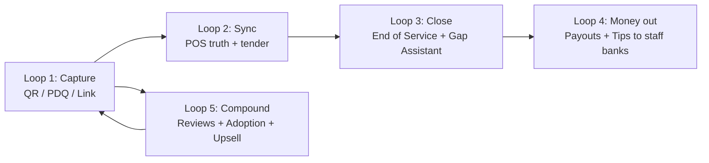

# Sunday-Parity Product Roadmap

**Source of truth:** the full Sunday help centre (`https://intercom.help/sundayapp-help/en/`) —
all 12 collections and their sub-collections/articles: *Getting started, My POS and sunday,
Dashboard (Home/Adoption, Mobile App, Operations, Staff Performance, Analytics, Reviews,
Payment Links, Tips, Accounting, Menu Management, Settings), Tips with sunday, Sunday For
Staff App, Payment terminal / Handheld, Menus (Order & Pay), Pay at Table, My reconciliation
with sunday, On the customer side, FAQ.*

**Purpose:** an exact, buildable feature roadmap for this codebase (PesaSwap Merchant App)
covering the four personas Sunday serves — **Merchant (owner/HQ)**, **Restaurant (venue
operations)**, **Staff (server/manager)** and **Customer (guest)**.

**Legend**
`✅ Have` = already shipped in this repo · `🟡 Partial` = exists but not to Sunday's depth ·
`🔴 Gap` = not built.

`✅ Have` means a merchant or a guest can actually reach it. A server contract with no surface
that renders it is `🟡 Partial`, however complete and well tested the contract is. Scoring the
API alone would flatter the roadmap and hide real work.

**Last verified:** 2026-08-25 against `6e25a4a` + working tree. Typecheck clean;
1,098 unit tests across 120 files passing; lint 0 errors; production build succeeds;
all 90 migrations apply cleanly to an empty database.
Accessibility: 11 `jsx-a11y` rules now at error level (0 violations), with
`label-has-associated-control` (74) the only remaining warning-level debt.

---

## 0. Capability model extracted from Sunday

Sunday is not "a payments app". It is a five-loop system. Every feature below belongs to one loop.

| Loop | Sunday's promise | Metric it moves |
| --- | --- | --- |
| 1. Capture | Guest pays in <30s without waiting for a server | Adoption rate, table turnover |
| 2. Sync | Every payment lands on the POS check as a `sunday` tender | Unsynced payments = 0 |
| 3. Close | Same-day reconciliation, not month-end surprises | Gap = 0 at close |
| 4. Money out | Merchant payout T+1; server tips in their bank Monday | Tip payout SLA |
| 5. Compound | Every payment = a review prompt + an upsell | 5★ Google reviews, avg ticket |

---

## PART A — CUSTOMER (Guest)

> Sunday articles: *Digital Bill · Pay at Table · Menus / Order & Pay · On the customer side ·
> Why did I pay additional fees · I forgot to download my receipt · I paid with sunday and I need
> a refund · How to log into my sunday account · Auto-gratuity · DCC.*

### A1. Digital Bill (scan → see bill → pay) — 🟡 Partial
| # | Feature | Status | Notes |
| --- | --- | --- | --- |
| A1.1 | QR on table resolves to a live bill (no printed receipt) | 🟡 | `src/routes/q.$code.tsx`, `src/api/qr.ts` — bill is local/order-derived, not POS-check-derived |
| A1.2 | Bill shows itemised lines, subtotal, tax, service charge | 🟡 | needs POS check payload |
| A1.3 | Bill auto-refreshes as the server rings items in | 🔴 | needs POS webhook + `realtime-do.ts` fan-out |
| A1.4 | "I still want a paper receipt" fallback path | ✅ | `POST /api/orders/:uuid/receipt` with `channel: "print"` → `src/lib/receipt-print.ts`; staff render + print it from the floor card via `PrintReceiptSheet` and the `@media print` rules in `src/styles.css` |
| A1.5 | Bill accessible after leaving the table (link survives) | 🟡 | `me.$token.tsx` portal exists |

### A2. Split the bill — ✅ Mostly done
| # | Feature | Status |
| --- | --- | --- |
| A2.1 | Split evenly by N guests | 🟡 |
| A2.2 | Split by item (select your own dishes) | ✅ `src/lib/split-apportion.ts`, `POST /api/qr/pay/:token/claim`, `db/72` |
| A2.3 | Pay a custom amount / part-pay | 🟡 |
| A2.4 | Live remaining-balance display as others pay concurrently | ✅ `src/lib/realtime-bus.ts` per-bill DO topic, `GET /api/qr/pay/:token/live` |
| A2.5 | Concurrency lock so two guests can't over-pay the check | ✅ `src/lib/split-lock.ts`, `db/61` |
| A2.6 | Each split shows as a separate transaction line on the dashboard | 🟡 |

**A2.2 apportionment rule.** `orders.total` is authoritative and already carries the discount,
tax and service charge; `order_items` only sum to the pre-discount subtotal. A by-item payer is
therefore charged their lines' *apportioned share of the total*, not the raw item subtotal —
largest-remainder (Hamilton) allocation, deterministic and exact to the cent, so any partition of
the lines sums back to the bill. A claimed line takes a `payment_holds` row under the same
`claimKey`, so the by-item, even-split and custom-amount paths all compete for one balance and
A2.5 still holds. A line whose payment succeeded is promoted to `paid` and is never re-claimable.

### A3. Tipping (guest side) — 🟡 Partial
| # | Feature | Status | Sunday rule to implement exactly |
| --- | --- | --- | --- |
| A3.1 | Tip suggestions at checkout | ✅ | |
| A3.2 | **Auto-gratuity-aware tiering** | ✅ | `<10%` incl. → show 20/23/25%; `10–17%` → pro-rate so total ≈20–25%; `>17%` → show 3/5/7% — `src/lib/tip-tiers.ts`, `db/68` |
| A3.3 | Custom tip amount + no-tip path | ✅ | |
| A3.4 | Tip attributed to the named server on the check | ✅ | `src/api/tips.ts` |
| A3.5 | Disable tips on payments with no bill attached | 🔴 | reconciliation-simplifying toggle |

### A4. Payment methods (guest) — 🟡 Partial
| # | Feature | Status |
| --- | --- | --- |
| A4.1 | Card (incl. saved card) | ✅ |
| A4.2 | Apple Pay / Google Pay | 🟡 |
| A4.3 | M-Pesa STK + KE-QR (local equivalent of meal vouchers) | ✅ |
| A4.4 | Meal-voucher / benefit-card tender class | 🔴 |
| A4.5 | International card acceptance | 🟡 |
| A4.6 | **DCC** — pay in your own currency with FX disclosure | 🔴 |
| A4.7 | 3DS step-up + explicit 3DS-failure handling | 🟡 |

### A5. Receipt, account & self-service — 🟡 Partial
| # | Feature | Status |
| --- | --- | --- |
| A5.1 | Digital receipt delivered instantly (screen + email/SMS) | ✅ |
| A5.2 | "I forgot to download my receipt" — retrieve by card/phone/email | ✅ `/receipt` + `POST /api/guest/receipt-lookup(/verify)`. OTP-verified, rate limited, fails closed, and answers identically for a known and an unknown contact — the challenge is always created, only a matched contact is messaged |
| A5.3 | Guest account login (passwordless) to see all past receipts | ✅ A5.2's verified lookup mints the existing `portal_tokens` bearer, so a guest who has left can get back into `/me/:token` (30-day link) without having just paid. Venue-scoped — cross-venue identity is **A5.8** |
| A5.4 | Guest-initiated refund request routed to the venue | ✅ `POST /api/portal/:token/refund-request` → `guest_refund_requests` (`db/74`), triaged at `/dashboard/guest-requests`. The guest can ask and never move money: approving records a decision, and `refunded` is only accepted against a real refund payment id on the same parent payment. `POST /api/refunds` is unchanged and still manager+ |
| A5.5 | Transparent **guest service fee** explainer at checkout ("optional, avoidable if you wait for the card machine") | ✅ `src/lib/fees.ts` guest-fee quote, rendered on `/pay` |
| A5.6 | Delete / modify my account (GDPR-style) | ✅ `POST /api/portal/:token/data-request` → `guest_data_requests` + `guest_data_request_events` audit trail (`db/74`). Completing an erasure is owner-only and REDACTS identifiers from the contact and from payment metadata; no ledger row is ever deleted. `src/lib/guest-privacy.ts` states the erasable/retained split the UI quotes verbatim |
| A5.7 | Charge + reconcile a NON-ZERO guest service fee (payment-intent fee component, net-of-fee balances) | 🔴 |
| A5.8 | **Cross-venue** guest account — one identity and one receipt history across every venue | 🔴 | portal tokens are venue-scoped by design; Sunday's account is not |

### A6. Order & Pay (guest ordering) — 🟡 Partial
| # | Feature | Status |
| --- | --- | --- |
| A6.1 | Browse the dynamic menu by QR | ✅ `q.$code.tsx` |
| A6.2 | Auto-translation of menu into N languages (AI) | 🔴 |
| A6.3 | Allergen + dietary tag display | ✅ |
| A6.4 | Photos & video on products | 🟡 |
| A6.5 | Add-ons / modifiers (size, extras) pulled from POS | 🔴 |
| A6.6 | **Related-product upsell** at item and cart level | 🔴 |
| A6.7 | Time-scheduled menus (lunch/dinner/happy hour) | 🟡 `pricing.ts` has happy hour |
| A6.8 | Order → kitchen → pay in one flow | ✅ `orders.ts` |
| A6.9 | Post-payment review prompt with prefilled star rating | 🟡 `reviews.ts` — the star the guest taps is captured, attributed and routed by the server (D6.2/D6.8). The star cannot be carried into Google's review form; only the venue's place is prefilled |

---

## PART B — STAFF (Server / Head waiter)

> Sunday articles: *Sunday For Staff App (all 9) · How to Get Notified of QR Code Payments ·
> How Servers Can Earn More · SFS training · Bank details on SFS · Balance if no bank details ·
> Create waiter / non-waiter account · Tips with sunday.*

### B1. Staff app foundation — 🟡 Partial
| # | Feature | Status | Notes |
| --- | --- | --- | --- |
| B1.1 | Phone-number signup + OTP verification | ✅ | `db/58-staff-credentials.sql`, `auth.ts` |
| B1.2 | Auto-enrolment: dashboard bulk-invites all servers by SMS | 🔴 | |
| B1.3 | QR-code account linking from the dashboard | 🔴 | |
| B1.4 | Roles: waiter / head waiter / supervisor / manager | ✅ | skills exist for each |
| B1.5 | **Link staff account ↔ POS cashier profile** (critical for attribution) | 🔴 **P1** | |
| B1.6 | Dashboard view: who has an account, who is linked, who is orphaned + alert banner | 🔴 | |
| B1.7 | Installable PWA + push permission onboarding | ✅ | `public/sw.js`, `push.ts` |
| B1.8 | In-app training module + completion tracking | 🔴 | |

### B2. Real-time service notifications — ✅ Have
Sunday's exact notification set. Each needs an event source, a push payload and a per-staff opt-in.
Delivery reuses the existing Web Push path (`push_subscriptions` + VAPID + payloadless tickle);
recipients are resolved by the pure filter in `src/lib/staff-notifications.ts` and fanned out by
`src/lib/staff-notify.ts`. Queue + prefs + follows live in `db/69`.

| # | Notification | Status |
| --- | --- | --- |
| B2.1 | Full payment received on table X | ✅ `payment.full` |
| B2.2 | Partial payment (split) — balance remaining | ✅ `payment.partial`, carries outstanding balance |
| B2.3 | Payment failed | ✅ `payment.failed` |
| B2.4 | 3DS payment failed | ✅ `payment.failed_3ds` |
| B2.5 | Potential fraud detected | ✅ `payment.fraud` |
| B2.6 | New order on table X | ✅ `order.new` |
| B2.7 | Order failed on table X | ✅ `order.failed` |
| B2.8 | **Potential walkout** | ✅ `walkout.potential`, fed by the C9.1 detector |
| B2.9 | **Unsynced payment — record it manually on the POS** | ✅ `payment.unsynced`, raised once on the transition to `Not Notified`. The body says the money **is** collected before anything else, so nobody chases the guest |
| B2.10 | New tip received | ✅ `tip.new`, attributed to the serving staff |
| B2.11 | New review received (esp. negative feedback) | ✅ `review.new`, negative flagged |
| B2.12 | Table fully paid — guests are leaving | ✅ `table.paid` |

**Supporting features**
- B2.13 **Table subscription** — server taps the tables they own; only those fire. ✅
  `staff_table_subscriptions` + "My tables" on `/staff-console`; table-scoped alerts are never
  broadcast, and an alert with no table and no direct attribution reaches nobody.
- B2.14 Per-notification-type on/off per staff member. ✅ `staff_notification_prefs`; absent row
  means the type default applies.
- B2.15 Quiet/shift-aware delivery tied to `shifts.ts`. ✅ a clocked-out member is skipped; a venue
  that does not track shifts is unaffected.

### B3. Act from the floor — 🟡 Partial
| # | Feature | Status |
| --- | --- | --- |
| B3.1 | Search a table → view its payments → **refund from the app** | ✅ `GET /api/tables/:id/payments`, `TableFloorActionsCard`, refund stays manager+ |
| B3.2 | Manually push a Sunday payment onto the POS check | 🟡 a manager can retry the push or record that they keyed it onto the POS by hand (`POST /api/pos/pushes/:id/{retry,record}`); doing it from the staff console is UI work |
| B3.3 | Report a walkout (guided flow, capture table + outstanding amount) | ✅ `WalkoutReportCard` on `/staff-console`, `POST /api/walkouts` |
| B3.4 | Contact support in-app (help centre + live chat) | 🔴 |
| B3.5 | Resend the bill / receipt to the guest | ✅ `POST /api/orders/:id/receipt` |
| B3.6 | Void / comp with manager approval | 🟡 (supervisor skill) |

**B3.1 authorisation.** The table-scoped payment READ is staff-level (`payments:read`,
redacted: masked guest number, no provider references) — the same level at which a server
already receives live payment events. The refund itself is unchanged: manager+ and
`payments:write` on `POST /api/refunds`. A server below manager sees a real, disabled
Refund button labelled "Needs a manager", never a hidden control and never an escalation.

### B4. Staff earnings — ✅ Mostly done
| # | Feature | Status |
| --- | --- | --- |
| B4.1 | Add/change **own bank details** in the staff app | ✅ `PUT /api/tips/me/payout-details` · `db/70` |
| B4.2 | Held balance when no bank details + reminder nudges | ✅ `status='held'` + staff-app banner |
| B4.3 | Personal tip ledger + payout history | ✅ `GET /api/tips/me` · `MyEarningsCard` |
| B4.4 | Personal performance: adoption %, tip rate, reviews, revenue/guest | 🟡 tip rate, revenue, average bill and reviews ship in `GET /api/tips/me`; **adoption % and revenue/guest need C5** (cover counts live on the POS check) |
| B4.5 | "Earn more" coaching prompts based on own metrics | 🔴 |

---

## PART C — RESTAURANT (Venue operations)

> Sunday articles: *Dashboard Operations (Manage Payments, QR codes, End of Service,
> line-by-line, floor plan) · Pay at Table (all 10) · Payment terminal / Handheld (all 21) ·
> Menus (all 9) · My reconciliation (all 5) · My POS and sunday (all 5).*

### C1. Payments operations console — ✅/🟡
| # | Feature | Status |
| --- | --- | --- |
| C1.1 | All transactions list | ✅ `dashboard/payments.tsx` |
| C1.2 | Filter by **status, table, check number, amount, server, card number (last4)** | 🟡 |
| C1.3 | Date presets (today/yesterday/custom range) | ✅ |
| C1.4 | CSV export of the filtered set | 🟡 |
| C1.5 | Split payments grouped under one table | 🔴 |
| C1.6 | **Retry attempts collapsed under the latest attempt** (expandable arrow) | 🔴 |
| C1.7 | Refund from the transaction row | ✅ `/api/refunds` |
| C1.8 | Guest fees shown separately and excluded from venue revenue | 🟡 `fees.ts` |
| C1.9 | Per-table payment view ("show me table 12's payments") | 🟡 |
| C1.10 | "Is this payment complete?" single-payment status drill-down | 🟡 |

### C2. End of Service + Gap Assistant — 🔴 **Flagship gap**
This is Sunday's most defensible feature. Build it as one epic.

| # | Feature | Status |
| --- | --- | --- |
| C2.1 | End-of-Service page aggregating **all** channels (QR + terminal + links) | 🔴 |
| C2.2 | Filters: date, **service (lunch/dinner/all)**, **revenue centre** (terrace, main room) | 🔴 |
| C2.3 | Business day = 04:00 → 04:00 local (configurable) | 🟡 `venue_service_settings` (`db/67`) provides a venue-local configurable boundary; End-of-Service consumption remains C2.1–C2.2 |
| C2.4 | Display totals **by payment contract / tender** | 🔴 |
| C2.5 | One-click "Search for discrepancies" | 🔴 |
| C2.6 | **Async analysis** — leave the page, come back to a finished report | 🔴 |
| C2.7 | **Persistent report** — manager runs it, accountant reads it later | 🔴 |
| C2.8 | Report freshness indicator + manual refresh | 🔴 |
| C2.9 | Instant discrepancy badge before running full analysis | 🔴 |
| C2.10 | Export for the accountant (no email ping-pong) | 🟡 |

### C3. Line-by-line reconciliation export — 🔴 Gap
Implement Sunday's exact CSV contract, one row per payment:

`sales amount without tips · reconciliation status · pos payment method id · pos payment mean ·
pos bill id · payment origin (PDQ | OP | PAT | LINK) · fast payment (bool) · bill id · payment id`

Statuses to compute exactly:
| Status | Meaning |
| --- | --- |
| `reconciled` | both sides agree on amount **and** bill |
| `reconciled with the amount only` | amount matches, bill id missing/wrong (typical fast payment) |
| `non reconciled: payment in pos unknown to sunday` | POS-only record |
| `non reconciled: sunday payment unknown to pos` | our-side-only record |

Plus: known discrepancy taxonomy surfaced as guidance —
(1) payment not notified to POS, (2) attributed to wrong tender, (3) wrong amount keyed manually,
(4) non-Sunday payment closed under the Sunday tender.

### C4. AI Reconciliation Assistant — 🔴 Gap
| # | Feature | Status |
| --- | --- | --- |
| C4.1 | Explain the probable cause of each discrepancy | 🔴 |
| C4.2 | Point to the exact part of the reconciliation needing attention | 🔴 |
| C4.3 | Prescribe the corrective action | 🔴 |
| C4.4 | Downloadable AI-generated comparison | 🔴 |
| C4.5 | Human stays the final validator (no auto-posting) | 🔴 |
| C4.6 | Gradual rollout flag per venue | 🔴 |
> Build on the existing `src/api/copilot.ts` + `src/lib/accounting.ts` rather than a new agent.

### C5. POS integration layer — 🔴 **Foundational gap**
Everything above depends on this. Nothing else in Part C is trustworthy without it.

| # | Feature | Status |
| --- | --- | --- |
| C5.1 | POS connector framework (auth, check pull, tender push, webhook in) | 🟡 `src/lib/pos/*`, `db/76`/`db/77` — vendor-neutral contract, check normalisation, tender outbox and scheduled recovery exist; live provider webhook ingestion remains provider-specific |
| C5.2 | **Toast** connector (partner install + `sunday` payment tender + manager-approval flag) | 🟡 `src/lib/pos/toast.ts` implements check pull/tender push; needs Toast partner credentials, published tender and supervised pilot |
| C5.3 | NCR Aloha / Omnivore, Lightspeed, Zelty, Trivec, Tevalis, L'addition class connectors | 🔴 |
| C5.4 | Menu sync from POS (locked "source-of-truth" catalogue) | 🔴 |
| C5.5 | Open-check pull → live digital bill | 🟡 Persisted check pull and scheduled refresh exist; QR/order consumption is pending |
| C5.6 | Payment push-back onto the check as a distinct tender | 🟡 Durable PesaSwap-payment outbox, mapped tender and lease-protected scheduled delivery exist; requires a verified POS connection |
| C5.7 | Second "manual/other" tender for exception handling | 🟡 Tender-map roles and manager manual-record path exist; provider/till configuration is an operator task |
| C5.8 | Refund-via-POS flow + "remove payment & void items" runbook | 🔴 |
| C5.9 | Where to split — POS vs our app — decision guardrails in UI | 🔴 |
| C5.10 | POS-compatibility matrix surfaced in-product (feature availability per POS) | 🔴 |
| C5.11 | Retry queue + `Unsynced payment` alert when push-back fails | 🟡 Lease/retry worker, scheduled recovery and one-time B2.9 alert exist; only activates with a verified mapped POS connection |

### C6. Digital / dynamic menu — 🟡 Partial
| # | Feature | Status |
| --- | --- | --- |
| C6.1 | Enable-dynamic-menu toggle (disables PDF menu) | 🔴 |
| C6.2 | **POS-synced catalogue** (read-only; price + VAT locked) | 🔴 |
| C6.3 | **Venue-authored menus** built from that catalogue | ✅ `menu.ts` |
| C6.4 | Categories: import from POS (locked) or create local; "convert to editable" | 🔴 |
| C6.5 | Per-product overrides: guest-friendly name, description, allergens, tags, photo, video | 🟡 |
| C6.6 | Add-ons/modifiers inherited from POS | 🔴 |
| C6.7 | **Related products / upsell** configuration | 🔴 |
| C6.8 | Menu header/cover image | 🟡 |
| C6.9 | Active toggle + "visible on Pay at Table" toggle | 🟡 |
| C6.10 | **Visibility schedule** per menu (days + time ranges) | 🟡 |
| C6.11 | Menu ordering / display sequence | 🟡 |
| C6.12 | External menu (PDF or URL) fallback | 🔴 |
| C6.13 | AI auto-translation into additional languages | 🔴 |
| C6.14 | Resync diffing: same POS id = auto-update, new id = flag for manual swap | 🔴 |

### C7. Physical estate: QR codes & floor plan — 🟡 Partial
| # | Feature | Status |
| --- | --- | --- |
| C7.1 | QR code management page (per table / per zone) | ✅ `dashboard/qr.tsx` |
| C7.2 | **Reorder physical QR stands/stickers** from the dashboard | 🔴 |
| C7.3 | Floor plan editor: tables, zones, revenue centres | 🟡 `dashboard/floorplan.tsx` |
| C7.4 | Change-floor-plan workflow with POS re-mapping | 🔴 |
| C7.5 | Revenue-centre tagging used across analytics + End of Service | 🔴 |

### C8. Payment terminal / Handheld (PDQ) — 🔴 Gap
A whole product line. 21 Sunday articles. Scope as a Phase-4 epic.

**Configuration & installation**
| # | Feature |
| --- | --- |
| C8.1 | Terminal provisioning + pairing to a venue |
| C8.2 | Amex MID capture |
| C8.3 | Preferred language per terminal |
| C8.4 | Terminal branding/customisation |
| C8.5 | Network settings + diagnostic tool |

**Features**
| # | Feature |
| --- | --- |
| C8.6 | Supported tender matrix (contactless, chip, swipe, wallets) |
| C8.7 | **Offline payment** capture + later settlement |
| C8.8 | International card acceptance |
| C8.9 | **DCC** currency-conversion prompt on foreign cards |
| C8.10 | Tips page on the terminal |
| C8.11 | Transaction limits |
| C8.12 | **Disable tips on payments without a bill** (reconciliation aid) |
| C8.13 | Reprint duplicate restaurant receipt |
| C8.14 | Card-receipt printing per transaction |
| C8.15 | Terminal transaction history + filtering |

**Transaction management**
| # | Feature |
| --- | --- |
| C8.16 | First-payment guided flow |
| C8.17 | Refund on terminal |
| C8.18 | Cross-terminal history divergence resolution |
| C8.19 | **Fast payment** mode + the 2-hour "record this on the POS" reminder |
| C8.20 | App update channel for the terminal |
| C8.21 | Assistance / maintenance / RMA workflow |

### C9. Walkout protection — ✅ Have (except the coverage guarantee)
| # | Feature | Status |
| --- | --- | --- |
| C9.1 | Potential-walkout detection (QR scanned, check open, table idle) | ✅ `src/lib/walkouts.ts`, venue-local idle threshold in `venue_walkout_settings` |
| C9.2 | Guided walkout report from dashboard **and** staff app | ✅ `/dashboard/walkouts` + `WalkoutReportCard` |
| C9.3 | Capture table + outstanding amount, keep the check open | ✅ nothing in the flow writes to `orders`; Step 1 copy is shown before the form |
| C9.4 | Guest can still pay from their phone → check auto-closes | ✅ same `consumer === "order"` path that stamps `orders.paid_at` → status `recovered` |
| C9.5 | Eligibility review + **venue-covered guarantee incl. server tip** | 🔴 (commercial decision — deliberately not built) |
| C9.6 | Walkout register + loss reporting | ✅ `GET /api/walkouts` (manager+) with reported / recovered / net-loss totals |

**On C9.5.** The lifecycle carries `status = 'under_review'` and a free-text `review_outcome`
so a business decision can be recorded against a walkout later. Nothing computes a covered
amount, nothing tops up a server's tip, and no surface tells a merchant they will be
reimbursed. Underwriting is not an engineering decision; until the business sets the criteria
and who funds them, `under_review` means "a human is looking at it" and nothing more.

**Authorisation split.** Reporting is staff+ — it is an incident report that moves no money,
closes no check and creates no credit, and Sunday's own flow runs from the staff app.
Resolving a walkout (write-off, review, dismissal) and reading the register + loss totals are
manager+. Every transition writes a `walkout_events` row with the actor and both statuses.
A `walkouts_live_per_order` partial unique index makes reporting idempotent: a double-tap, or
the same table reported from the dashboard and the staff app at once, converges on the
existing row instead of doubling the recorded loss. All routes are human-only — a PAT has no
floor and no accountability.

---

## PART D — MERCHANT (Owner / Finance / HQ)

> Sunday articles: *Getting started · Dashboard Home & Adoption rate · Analytics/Overview ·
> Staff Performance · Reviews · Payment Links · Tips · Accounting (Revenues, Invoices, Payouts) ·
> Settings · FAQ (What's in it for you, contact support, onboarding FAQ).*

### D1. Onboarding & account — 🟡 Partial
| # | Feature | Status |
| --- | --- | --- |
| D1.1 | Self-serve account creation | ✅ `/get-started` |
| D1.2 | Passwordless + SSO dashboard login | ✅ |
| D1.3 | Guided activation checklist (bank details, POS, QR, staff, menu, Google) | 🔴 |
| D1.4 | Onboarding FAQ / in-product help centre | 🔴 |
| D1.5 | Account-manager + 24/7 support entry point in-app | 🔴 |

### D2. Home & adoption — 🔴 Gap
| # | Feature | Status |
| --- | --- | --- |
| D2.1 | Home page with today's live snapshot | 🟡 `dashboard/index.tsx` |
| D2.2 | **Adoption rate** = QR-paid revenue ÷ total venue revenue (needs POS total) | 🔴 |
| D2.3 | Adoption trend + benchmark vs comparable venues | 🔴 |
| D2.4 | Adoption levers coaching card (signage, staff training, UX) | 🔴 |
| D2.5 | Adoption → reviews / tips / turnover / revenue impact model | 🔴 |

### D3. Analytics — 🟡 Partial
| # | Feature | Status |
| --- | --- | --- |
| D3.1 | Turnover, shifts, covers with weekly comparison | 🟡 |
| D3.2 | **Financial performance**: revenue incl. tax, bill count, cover count, avg ticket/person, tender mix, revenue by day & service, covers by day & service | 🟡 |
| D3.3 | **Know your customers**: our-channel payment volume, % of revenue by covers, avg ticket **by nationality**, tipping **by nationality** | 🔴 |
| D3.4 | **Customer feedback**: customers, repeat customers, repeat rate | 🟡 `rfm.ts` |
| D3.5 | **Compare your restaurants** (multi-site league table) | 🟡 `multistore.ts`, `dashboard/chain.tsx` |
| D3.6 | Scheduled email digest of the above | 🔴 |

### D4. Staff performance — 🔴 Gap
Sunday's exact per-server metric set, date-filterable:

| # | Metric | Status |
| --- | --- | --- |
| D4.1 | Usage — number of guests scanning the QR | 🔴 |
| D4.2 | **Adoption %** — scanners who actually paid with us | 🔴 |
| D4.3 | Average review rating per server | 🔴 |
| D4.4 | Total reviews generated | 🔴 |
| D4.5 | **5★ Google reviews generated** | 🔴 |
| D4.6 | Tip rate (avg %) | 🟡 |
| D4.7 | Total tips | ✅ |
| D4.8 | Total revenue | 🟡 |
| D4.9 | Revenue per guest | 🔴 |
| D4.10 | Leaderboard + coaching/training flags | 🔴 |

### D5. Tips management (merchant side) — ✅ Mostly done
| # | Feature | Status |
| --- | --- | --- |
| D5.1 | **Collection** view: total tips by period, split QR vs terminal, direct-to-server vs tip jar | ✅ `GET /api/tips/collection` — capture channel comes from the payment's own channel/source; a terminal split appears when C8 ships one |
| D5.2 | **Distribution** view: distribution history + amount available for next payout | ✅ `GET /api/tips/jar` |
| D5.3 | Distribution by **fixed amount** per employee | ✅ `POST /api/tips/jar/distribute` `method=fixed` |
| D5.4 | Distribution by **hours worked** (from `shifts.ts`) | ✅ `POST /api/tips/jar/distribute` `method=by_hours` |
| D5.5 | **Model 1: 100% direct to head waiters**, auto-paid weekly | ✅ `model='direct'`, paid by `runTipCadence` on the Monday after the week closes |
| D5.6 | **Model 2: 100% tip jar**, manager distributes, weekly window | ✅ `model='jar'` |
| D5.7 | **Model 3: split %** direct vs jar, per server | ✅ `model='split'` + `staff_tip_rules.direct_pct` |
| D5.8 | Weekly cadence engine (jar opens Monday 18:00; distribute Mon–Sun; paid following Monday; late = S+2) | ✅ `src/lib/tip-cadence.ts`, venue-local and DST-safe, 22 unit tests |
| D5.9 | Per-server rules table + edit actions + per-server history | ✅ `GET/PUT /api/tips/rules` |
| D5.10 | **Alert banner: server has no linked POS account** | 🟡 **Substituted** — with no POS we warn on what actually blocks the payout: a server with no payout details. The literal POS-account check needs C5 |
| D5.11 | Add a new server to enable tips (invite flow) | 🟡 A new team member appears in Rules immediately and self-serves their payout details; there is still **no outbound invite message** |
| D5.12 | Change the phone number bound to a POS user | 🔴 |
| D5.13 | Payouts to staff bank accounts (with unbanked-balance handling) | 🟡 Unbanked handling is done (`held` + release); the **M-Pesa wallet rail is the only live destination** — a `bank` destination is stored but held with `bank_rail_unavailable` |

### D6. Reviews & reputation — 🟡 Partial (the loop is closed; Google needs credentials)
| # | Feature | Status |
| --- | --- | --- |
| D6.1 | Post-payment 1–5★ prompt | ✅ `reviews.ts` |
| D6.2 | **Redirect to Google with the rating prefilled** | 🟡 The redirect is real and server-decided (`routeRating`, `db/71.google_place_id`) and opens `search.google.com/local/writereview?placeid=…` for the venue's own profile. **The star value itself cannot be prefilled** — Google exposes no documented query parameter for it, so the guest taps the star again on Google. Sunday's "already prefilled" describes the same URL |
| D6.3 | Google account connection (OAuth) | 🟡 Full authorize → callback → location-picker flow (`src/lib/google-business.ts`). Real API calls, **inert without `GOOGLE_OAUTH_CLIENT_ID`/`_SECRET`** — the dashboard renders an explicit `not_configured` / `not_connected` state rather than faking data |
| D6.4 | Review analytics: avg rating, trend, **% originating from us** | ✅ `GET /api/reviews/analytics` — average, monthly evolution, and the payment-flow share vs Google-imported |
| D6.5 | Reply to Google reviews from the dashboard | 🟡 The reply is saved locally and pushed to Google via `mybusiness/v4 …/reply` when the review carries a `google_review_id` and the connection is live; **unverifiable end to end until D6.3 has credentials** |
| D6.6 | **Reply templates** library | ✅ `review_templates` + 5 built-in starters, `@customer_name@` / `@venue_name@` substitution |
| D6.7 | AI-suggested responses | ✅ `POST /api/reviews/:id/reply` with no body; tone now follows the venue's own threshold instead of a hardcoded 1–2★ rule |
| D6.8 | Negative-feedback interception → staff alert before it goes public | ✅ Sub-threshold ratings are never routed to Google and raise `review.new` with `intercepted: true` (reuses the B2 staff-notification rail) |
| D6.9 | Review attribution to the serving staff member | ✅ Per-server count / average / 5★ / sub-threshold in the analytics payload and the Reviews tab |

### D7. Payment links — ✅/🟡
| # | Feature | Status |
| --- | --- | --- |
| D7.1 | Create a link with amount + description | ✅ `pay-links.ts` |
| D7.2 | Customer-facing hosted checkout | ✅ |
| D7.3 | Single-use (dead after payment) | 🟡 |
| D7.4 | Link status tracking list | ✅ |
| D7.5 | Settles into the normal payout | ✅ |
| D7.6 | Refundable from the payments page | ✅ |
| D7.7 | **Distinct pricing tier vs QR payments** | 🔴 |
| D7.8 | Warning: link payments must be added to the POS manually | 🔴 |
| D7.9 | Deposits & pre-payments use case (events, catering) | ✅ `dashboard/deposits.tsx` |
| D7.10 | Feature-flagged per venue | 🟡 |

### D8. Accounting & payouts — 🟡 Partial
| # | Feature | Status |
| --- | --- | --- |
| D8.1 | **Revenues tab**: link every income to the bank transfer received | 🟡 |
| D8.2 | Business day 04:00→04:00 + custom period selector | 🟡 Configurable venue-local boundary in Settings (`db/67`); existing Accounting custom range selector remains available; revenues integration follows D8.1 |
| D8.3 | Revenue breakdown: cards via QR, "other revenues" (adjustments, positive/negative) | 🔴 |
| D8.4 | "See details" → income ⇄ payout linkage | 🔴 |
| D8.5 | **Payouts file** (1 row per payout) for bank-statement matching | 🟡 `settlement.ts` |
| D8.6 | **Operations file** (1 row per transaction) for deep-dive | 🟡 |
| D8.7 | Payouts tab: schedule, status, expected date | 🟡 |
| D8.8 | Configurable **bank transfer label** | 🔴 |
| D8.9 | Invoices tab: our fee invoices to the merchant, downloadable | 🟡 `invoices.ts` |
| D8.10 | Meal-voucher/alt-tender settlement ownership disclosure | 🔴 |
| D8.11 | Accountant role with read + export only | 🟡 |
| D8.12 | Chargeback policy + dispute workflow | ✅ `disputes.ts` |

### D9. Settings — 🟡 Partial
| # | Feature | Status |
| --- | --- | --- |
| D9.1 | General venue information | ✅ |
| D9.2 | **Service hours** (defines lunch/dinner everywhere) | 🟡 Owner-configurable per-day lunch/dinner hours persisted in `venue_service_settings` (`db/67`); operational reports consume them in C2 |
| D9.3 | Payment information / bank details | 🟡 |
| D9.4 | Reconciliation settings (business day, tender mapping) | 🔴 |
| D9.5 | Reputation settings: templates + AI responses | 🟡 |
| D9.6 | **User management** — add/remove dashboard users with roles | ✅ `dashboard/team.tsx` |
| D9.7 | Menu settings (dynamic menu toggle, languages) | 🔴 |
| D9.8 | Product-dependent settings visibility (only show what you own) | 🟡 `billing.ts` plans |
| D9.9 | Staff-app auto-enrolment toggle | 🔴 |

---

## PART E — Delivery plan

### Phase 1 — Trust the money (highest leverage, no new surface)
1. **C5.1–C5.2, C5.6, C5.11** POS connector framework + Toast + tender push-back + unsynced retry.
2. ~~**A2.5** split-payment concurrency lock.~~ ✅ **DONE** — a share of the outstanding
   balance is now reserved under a per-order `FOR UPDATE` lock (`payment_holds`, `db/61`),
   so concurrent guests can no longer each be granted the whole remainder. Holds carry a
   120s TTL, are keyed by the request's `Idempotency-Key` so a retry re-competes for its
   own share, and are released explicitly on a decline or an abandoned payment intent.
3. **B1.5** staff ↔ POS cashier profile linking.
4. ~~**B2.9 + B2.2 + B2.1** the three notifications that prevent lost money.~~ ✅ **DONE**
   — the whole B2 set now ships. **B2.9** (unsynced payment) landed with C5.6: it is raised
   once, on the transition to `Not Notified`, and tells the server the money is already
   collected. **B2.8** (potential walkout) landed with C9.1. Table subscription (B2.13),
   per-type opt-in (B2.14) and shift-awareness (B2.15) are live, so a server is paged only
   for the tables they tapped at the start of their shift.
5. ~~**D9.2** service hours + **C2.3 / D8.2** 04:00 business day.~~ 🟡 **DONE (config layer)**
   — `db/67` + `src/lib/business-day.ts` + Settings UI. Report consumption lands with C2/D8.

**Exit criteria:** every captured payment appears on the POS check under our tender within 60s, or
raises an actionable alert. Zero silent unsynced payments over a 7-day live pilot.

### Phase 2 — Close the day
6. **C2** End of Service page (filters, service, revenue centre, async + persistent report).
7. **C3** line-by-line CSV with Sunday's exact four statuses.
8. **C4** AI Reconciliation Assistant on top of `copilot.ts`.
9. **D8.1–D8.8** Revenues ⇄ payouts linkage, payouts file, operations file, transfer label.

**Exit criteria:** a manager can close the day in <5 minutes and an accountant needs zero emails.

### Phase 3 — Pay the people
10. ~~**B4.1–B4.2** staff bank details + unbanked balance holding.~~ ✅ **DONE** — `db/70`
    adds `staff_payout_details`; the account number is AES-GCM ciphertext under
    `STAFF_PAYOUT_KEY` with only a 4-digit tail readable, staff write their own row and
    nobody — manager included — ever reads more than the tail. A payout with no usable
    destination is `held`, keeps its allocations reserved, and is released automatically
    on the next cadence run. **`db/84` adds a step-up:** writing a destination now
    requires a one-time code delivered on WhatsApp (SMS fallback) to the phone on that
    staff member's own record — a borrowed staff session is no longer enough to repoint
    someone's tips. The destination phone is read from the database and never from the
    request, the code is bound to `payout:<staff_id>` so a login code cannot be replayed,
    and `staff_payout_details.confirmed_via_phone` records which number confirmed it.
    Rendered in `MyEarningsCard` as a two-step flow, and pinned by
    `__tests__/unit/payout-step-up.test.ts` (17 assertions, including "no confirmation,
    no write").
11. ~~**D5.5–D5.8** the three tip models + the weekly cadence engine.~~ ✅ **DONE** —
    one `kind='weekly'` pool per venue per collection week carries both streams, with the
    direct/jar split snapshotted per payment id in `tip_pool_sources`. `src/lib/tip-cadence.ts`
    implements Sunday's rule verbatim: the jar opens Monday 18:00 venue-local, the manager
    distributes any time Monday–Sunday, and staff are paid the Monday that starts the week
    after the distribution week — so a slipped week lands on S+2.
12. **D5.10, D5.12** POS-link alerting and phone rebinding. 🟡 D5.10 ships with a
    payout-details substitution (the POS-account check itself needs C5); D5.12 is untouched.
13. **D4** full staff performance metric set + leaderboard. 🟡 B4.4 ships the personal
    slice (tip rate, revenue, average bill, reviews); adoption % and revenue/guest wait on C5.

**Exit criteria:** tips land in staff bank accounts on a published weekly SLA, fully attributed.

### Phase 4 — Compound growth
14. ~~**D6.2–D6.5, D6.9** Google OAuth, prefilled rating redirect, replies, per-server
    attribution.~~ **Done**, together with D6.6–D6.8. `db/71` adds the venue-configurable
    public-redirect threshold, the Google identifiers and the template library;
    `src/lib/google-business.ts` is a real Business Profile client that stays inert without
    operator secrets. D6.2/D6.3/D6.5 stay 🟡 for the reasons stated in their rows — the star
    cannot be prefilled on Google's URL, and the OAuth half cannot be exercised without
    credentials.
15. **D2** adoption rate + trend + coaching.
16. **C6** POS-synced dynamic menu, **A6.5–A6.6** modifiers + upsell, **A6.2/C6.13** AI translation.
17. ~~**A3.2** auto-gratuity-aware tip tiering; **A5.5** fee transparency.~~ **Done** — pulled
    forward out of sequence at the user's explicit request. `src/lib/tip-tiers.ts` implements the
    `<10% / 10–17% / >17%` bands and `db/68` gives the bill a `service_charge` column for the POS
    (C5) to populate; until then every bill reads 0 and the standard 20/23/25% tiers apply.
    A5.5 ships the checkout explainer against a server-quoted, currently zero-rated guest fee;
    **A5.7** tracks actually charging one.

**Exit criteria:** measurable lift in reviews/cover, avg ticket, and adoption rate.

### Out of sequence — guest self-service ("On the customer side")
17b. ~~**A5.2, A5.3, A5.4, A5.6, A1.4**~~ **Done** — pulled forward out of phase order at the
    user's explicit request; recorded here as the deviation. None of them depend on C5, so
    nothing was built on unreconciled order data. `db/74` adds `guest_refund_requests`,
    `guest_data_requests`, `guest_data_request_events` and `contacts.redacted_at`.

    Deliberately **not** built, and why:
    * **Card last-4 / transaction-total narrowing** on the A5.2 lookup. Sunday's support
      agents use those to identify a guest by hand; automating them as *inputs* would make
      the endpoint a card-and-amount guessing surface. Ownership of the contact is proven by
      OTP instead, which is strictly stronger.
    * **Email-subject portal tokens.** `payments.metadata` carries `customer_phone` and no
      email, so an email is accepted as an IDENTITY (resolved through the venue's contact
      record to a phone) but never as a token subject. An email-only contact with no phone
      cannot be resolved to receipts and is treated as no match.
    * **A5.8 cross-venue identity** — a new row, not a silent extension of A5.3.
    * **Guest-triggered refunds.** By design. The guest's request is a work item; the money
      still moves only through manager-gated `POST /api/refunds`.

### Phase 5 — Hardware & edge
18. **C8** terminal/handheld line (config, offline, DCC, fast payment + 2h reminder, receipts, history).
19. ~~**C9** walkout protection end-to-end.~~ ✅ **DONE (C9.1–4, C9.6)** — detection, guided report
    from both surfaces, auto-close on a returning guest's payment, and the loss register.
    **C9.5** (coverage guarantee) is deliberately unbuilt: it is an underwriting decision.
20. **A4.6 / C8.9** DCC; **A4.4** voucher tenders; **C7.2** physical QR reordering.

---

## PART F — Cross-cutting requirements

| Area | Requirement |
| --- | --- |
| Data model | `pos_connections`, `pos_checks`, `pos_check_lines`, `pos_tender_map`, `revenue_centres`, `services`, `reconciliation_runs`, `reconciliation_lines`, `staff_bank_accounts`, `tip_cycles`, `walkouts`, `terminals`, `terminal_transactions` |
| Realtime | Extend `src/realtime-do.ts` to a per-table topic bus feeding B2.x notifications and A1.3 live bills |
| Async jobs | Reconciliation runs must be queued + resumable (C2.6/C2.7) — not request-scoped |
| Security | POS credentials in secrets, never in `app_settings`; refunds and manual tender pushes stay manager+ gated; walkout coverage claims need an audit trail |
| Tenancy | Revenue centre + service are tenant-scoped dimensions on every analytic query |
| Compatibility | Ship a POS capability matrix; degrade features gracefully and say so in the UI |
| Accessibility of truth | Every number on every dashboard must be traceable to a payment id and a POS bill id |

---

## PART G — Scorecard

| Persona | Sunday capabilities catalogued | Have | Partial | Gap |
| --- | --- | --- | --- | --- |
| Customer | 35 | 21 | 10 | 4 |
| Staff | 31 | 24 | 3 | 4 |
| Restaurant | 62 | 19 | 13 | 30 |
| Merchant | 60 | 23 | 21 | 16 |
| **Total** | **188** | **87** | **47** | **54** |

**Every B2 notification now exists.** B2.9 (`Unsynced Payment`) was the last one, and the last
thing in Part B that was waiting on the POS.

**The money path is built but unproven.** A payment now travels: capture → financial event →
`pos-tender` outbox consumer → durable intent → leased worker → a `sunday` tender line on the
POS check; or `Not Notified` plus an alert to the server who owns that table. **No payment has
ever made that journey against a real POS**, because we hold no Toast partner credentials. The
simulator connector exercises the path end to end, which proves our side of the contract and
nothing whatever about Toast's. Do not enable it for a paying venue before a supervised pilot.

**C5 still gates the rest.** Of the 54 remaining gaps, roughly two thirds are POS-derived —
chiefly C2 (End of Service), C3 (line-by-line), C4 (the AI reconciliation assistant) and C8 (the
terminal line). With C5.5 and C5.6 in place **C3 is now buildable**: the POS side of a
reconciliation finally has somewhere to live.
