# Amina: merchant owner walkthrough

**Goal:** create the business, make it guest-ready, delegate operations, and
finish with trustworthy payment and accounting records.

**Evidence:** steps 1-9 were completed in the live sandbox. Payment simulation
was enabled, so no real money moved.

## 1. Discover the product

**Route:** `/get-started`

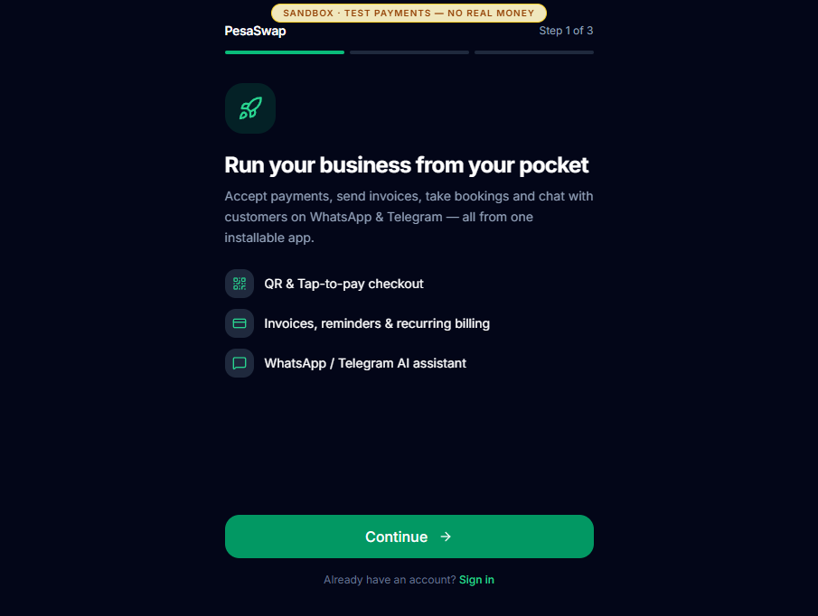

Amina starts with the operational offer, not a marketing landing page. The first
screen names the three core jobs: take QR/Tap payments, invoice customers and use
the channel assistant. `Continue` advances to account details.

## 2. Create the owner and venue together

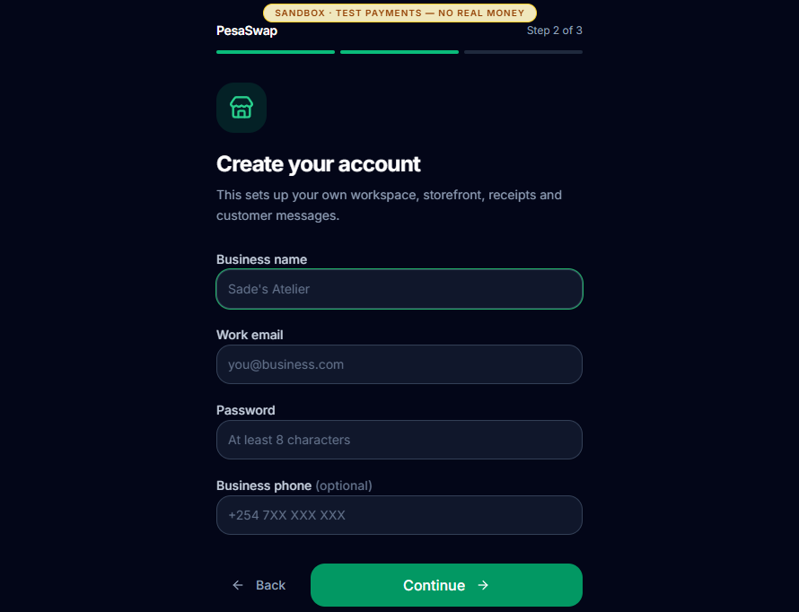

Amina enters the business name, work email, password and optional phone. Submitting
this flow creates both the merchant principal and an isolated venue. The captured
venue is **PesaSwap Walkthrough Cafe**.

## 3. Choose whether to install the PWA

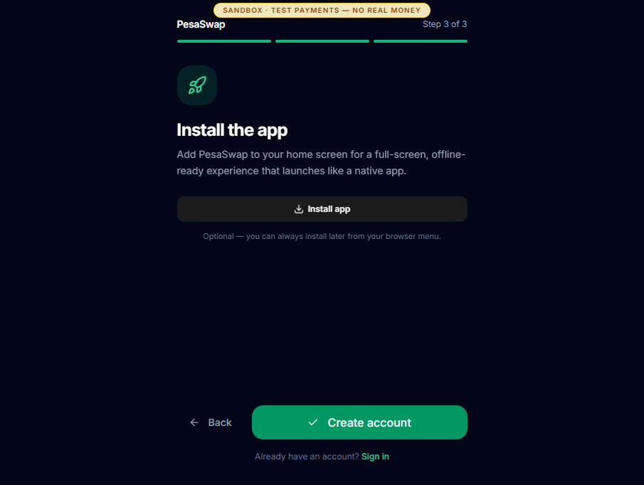

Installation is optional. `Create account` completes onboarding even when Amina
does not install immediately. The sandbox then signs her in and routes directly
to `/dashboard`.

## 4. Use the first-run checklist

**Route:** `/dashboard`

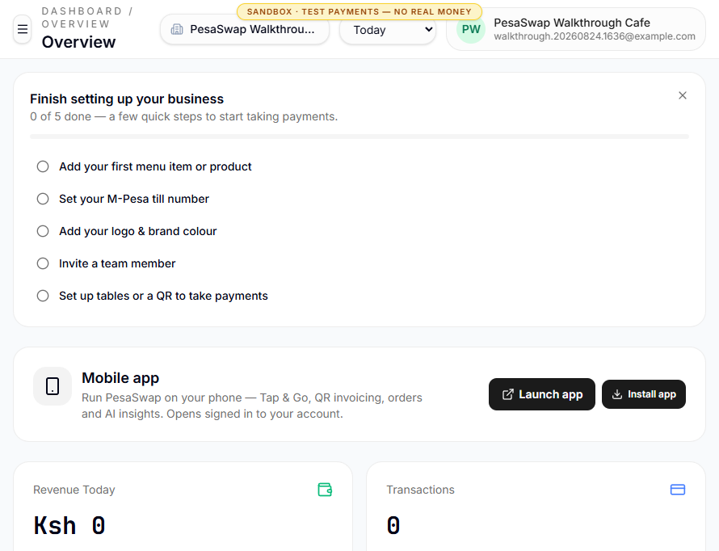

The checklist gives Amina five concrete activation jobs:

1. Add a menu item.
2. Set the M-Pesa till.
3. Add brand identity.
4. Invite a teammate.
5. Create tables or a QR.

The KPI cards correctly begin at zero for the new venue. The `Launch app` action
hands the current session to the installable mobile operator app.

## 5. Configure the business and payment identity

**Route:** `/dashboard/settings`

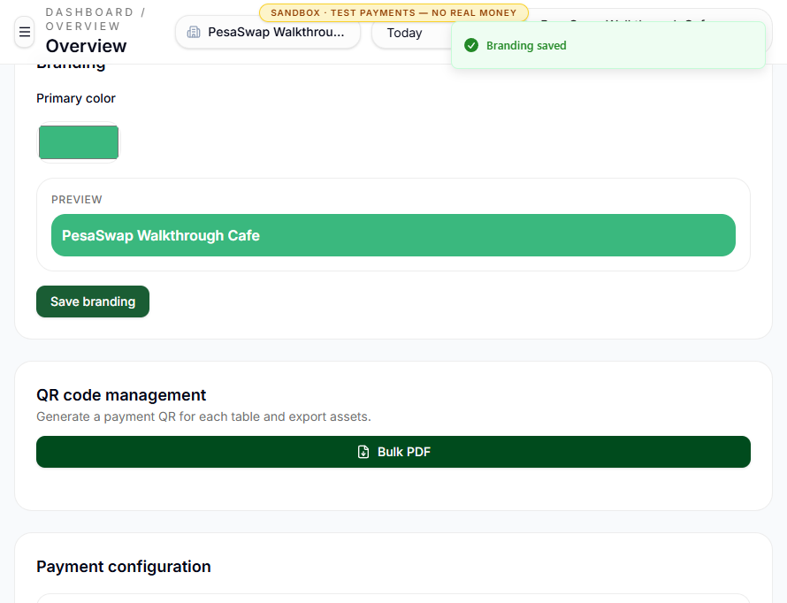

Amina sets the till (`123456` in this disposable sandbox), address, phone and
brand colour. This screen also controls enabled payment methods and suggested tip
percentages. The capture shows the successful `Branding saved` confirmation.

No logo was uploaded during this run.

## 6. Publish a small catalogue

**Route:** `/dashboard/menu`

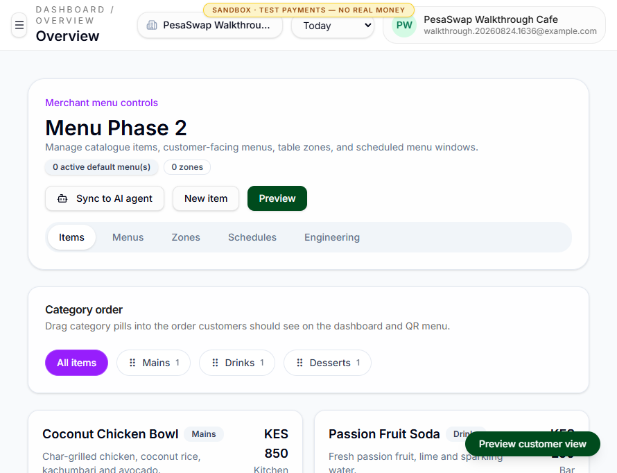

Amina creates three server-backed products:

| Product              | Category |   Price | Destination |
| -------------------- | -------- | ------: | ----------- |
| Coconut Chicken Bowl | Mains    | KES 850 | Kitchen     |
| Passion Fruit Soda   | Drinks   | KES 250 | Bar         |
| Cardamom Carrot Cake | Desserts | KES 420 | Kitchen     |

Dietary badges are visible to the guest. Category ordering, availability,
modifiers, linked products and customer preview are managed from this same page.

## 7. Create the customer entry point

**Route:** `/dashboard/qr`

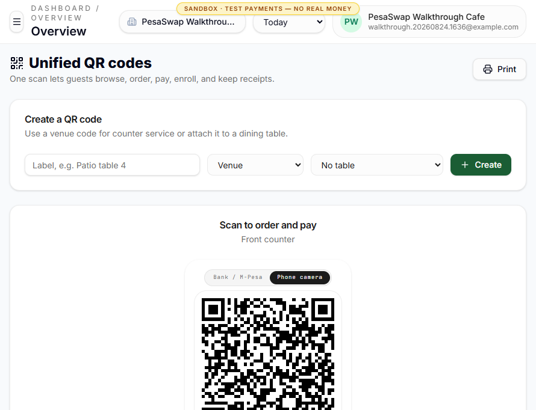

Amina creates a venue QR labelled **Front counter**. The UI produces both a
phone-camera QR and a Bank / M-Pesa view, plus a shareable `/q/<code>` URL. This
exact code starts [James's guest walkthrough](04-JAMES-GUEST.md).

## 8. Delegate venue operations

**Route:** `/dashboard/team`

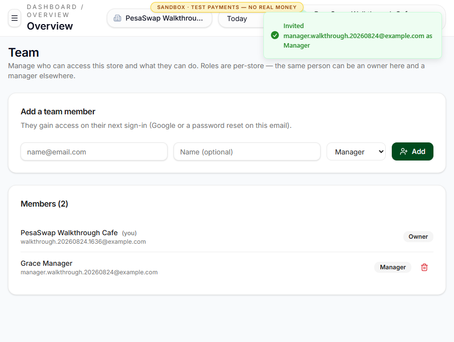

Amina invites **Grace Manager** with a venue-scoped `Manager` role. Grace can
sign in by email OTP and operate this store, but cannot silently become the owner
or enter another venue.

## 9. Review what the guest payment produced

**Route:** `/dashboard/payments`

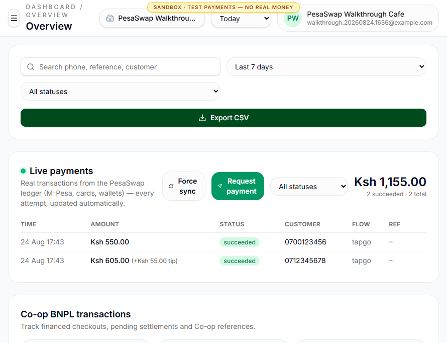

James's split bill appears as two succeeded ledger events:

- KES 550 from the second guest.
- KES 605 from the first guest, including the KES 55 tip.

The total cash/mobile-money inflow is KES 1,155. Search, status filters, force
sync, payment requests and CSV export are available here.

## 10. Finish in the books

**Route:** `/dashboard/accounting`

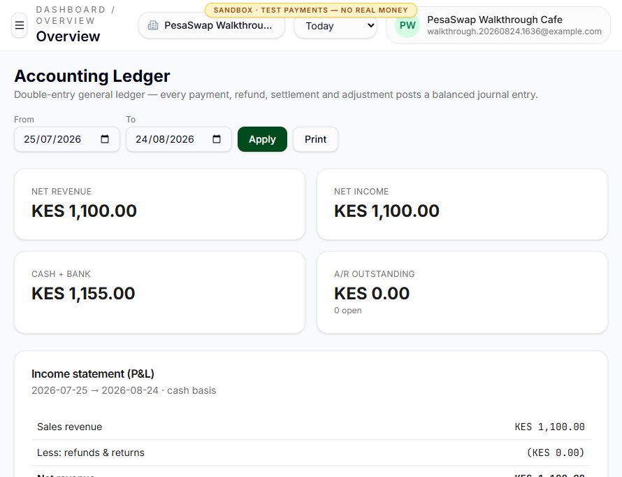

The accounting view separates the KES 1,100 sale from the KES 55 liability owed
to staff. The observed balance sheet was balanced:

- Cash and mobile money clearing: KES 1,155.
- Sales revenue / retained earnings: KES 1,100.
- Tips payable: KES 55.

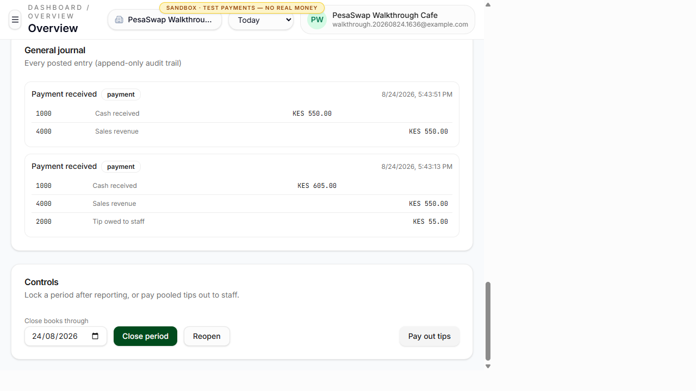

At the end of a reporting period, Amina can close or reopen the books and trigger
tip payout. These controls are owner-only. They were photographed but not invoked
because closing the disposable period was not needed for the walkthrough.

## End state

Amina has a live venue, catalogue, QR, delegated manager, succeeded payment
ledger and balanced double-entry journal. The owner journey is complete for the
captured transaction.

## Observed gaps and UX notes

- The overview and onboarding checklist use some browser snapshot state. They did
  not become the authoritative proof of trade; the server-backed payment and
  accounting pages did.
- The submitted five-star guest review did not finish loading on
  `/dashboard/reviews` during this run, so no owner review screenshot is claimed.
- Settings combine account, venue identity, QR export, payment switches and user
  management in one long page. The flow works, but the ownership boundaries are
  visually dense.
- Full POS reconciliation, imported bank evidence and the End of Service Gap
  Assistant are not present in this journey.
