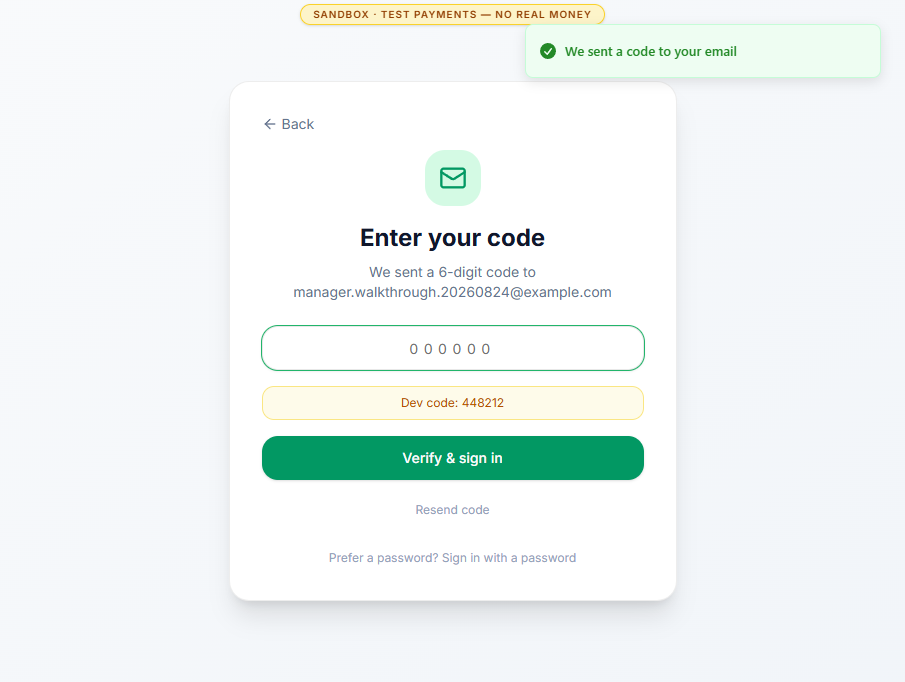
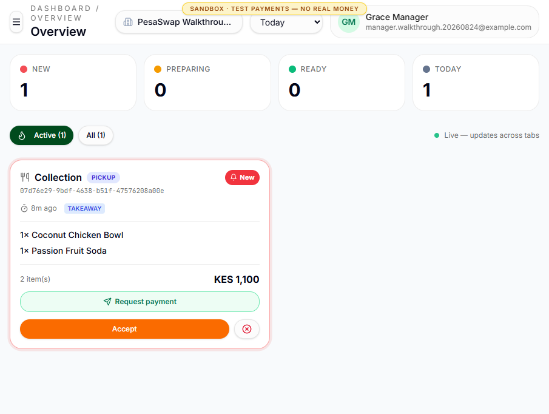
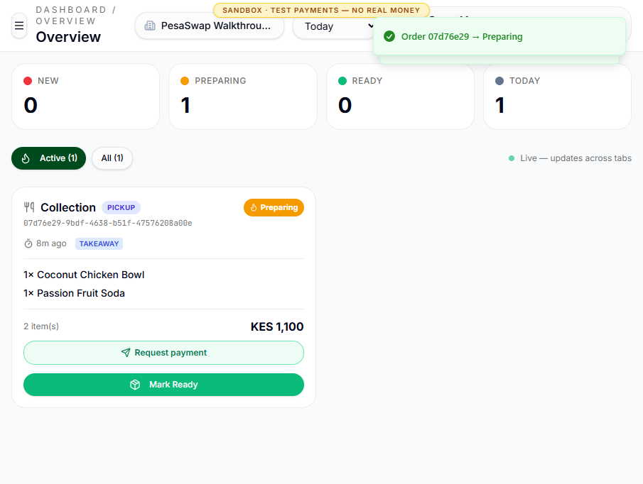
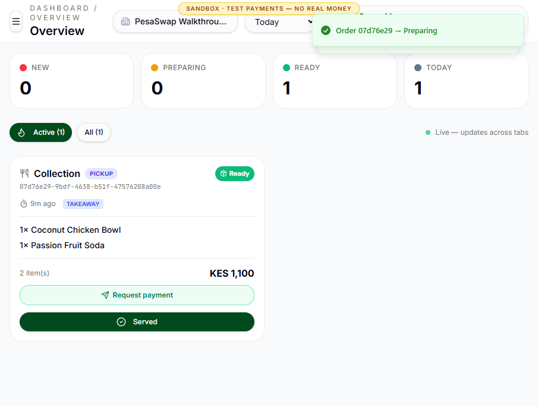
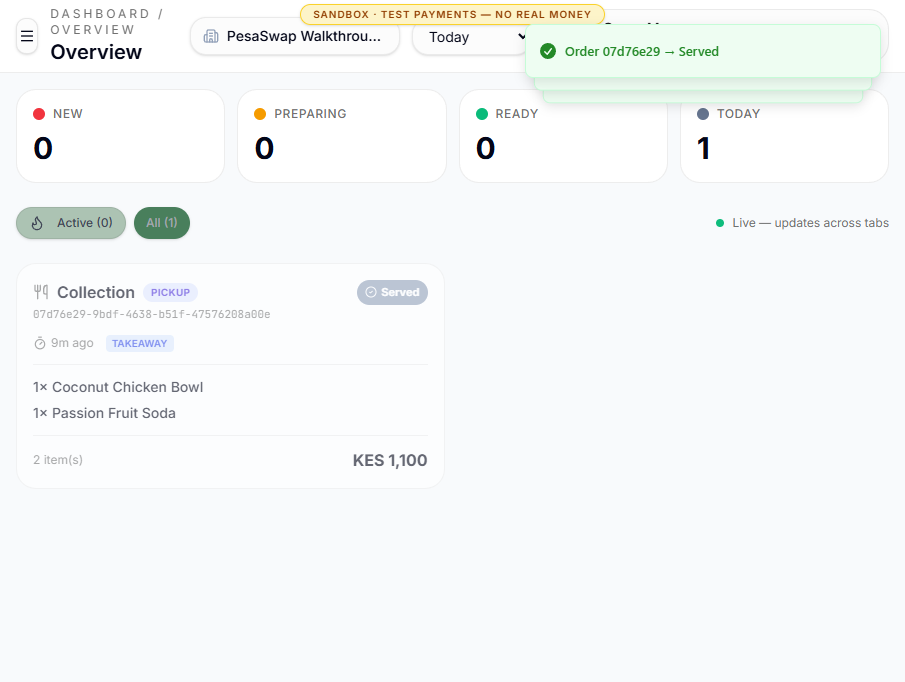
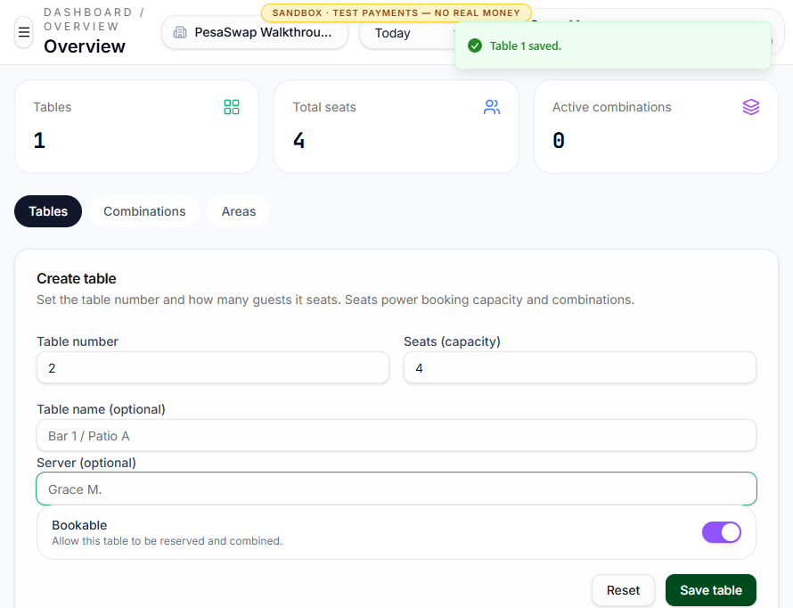
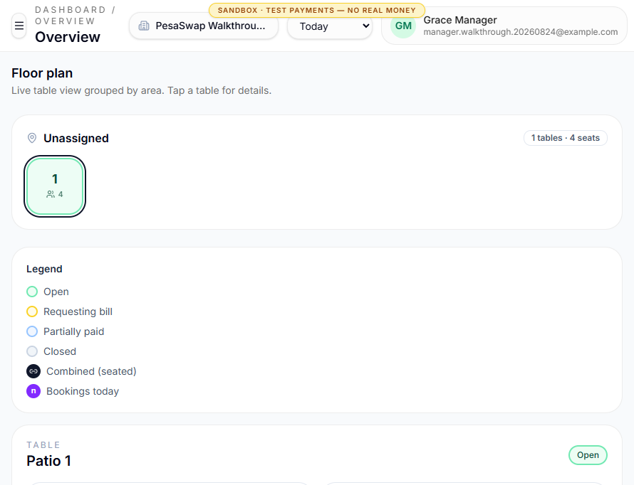
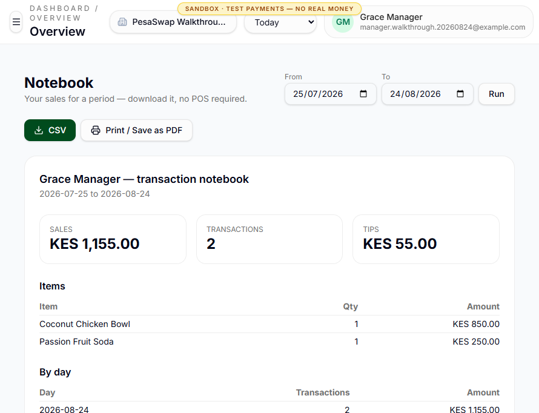
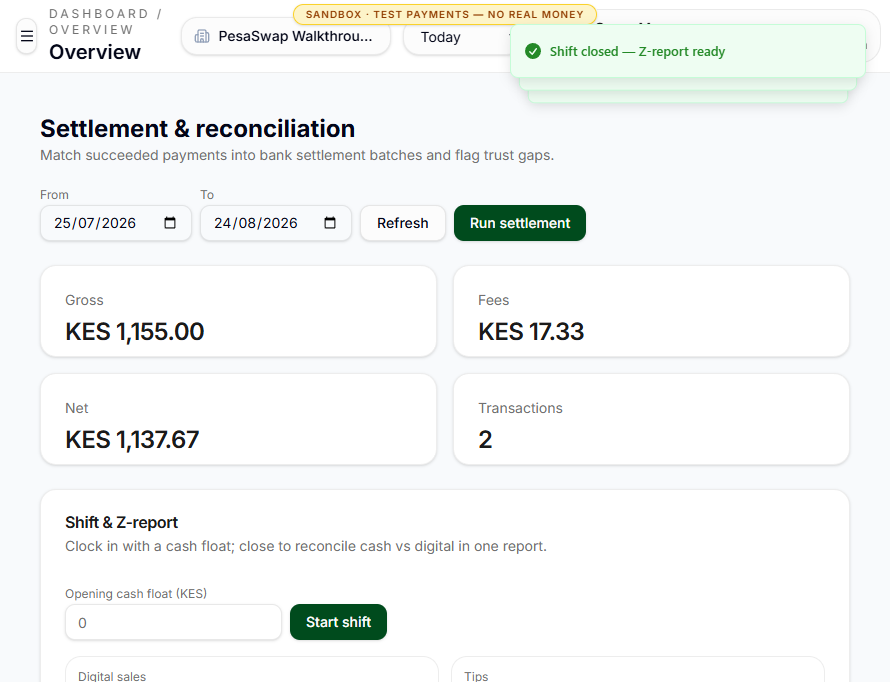

# Grace: venue and kitchen manager walkthrough

**Goal:** open the venue, control the floor and kitchen, then close service with a
report and a reconciled application batch.

**Evidence:** this flow used the live sandbox and the manager role invited by
Amina. The order is the same KES 1,100 order created in James's walkthrough.

## 1. Enter through the venue invitation

**Route:** `/sign-in`

Grace chooses email sign-in. The sandbox sends a six-digit OTP and, because
`AUTH_OTP_DEBUG=1` there, displays the development code. Verification lands Grace
on `/dashboard` with the `manager` role and the correct venue.

In production, the one-time code must be delivered out of band and must not be
rendered in the UI.

## 2. Receive the guest order in KDS

**Route:** `/dashboard/orders`

The counter order arrives as one collection ticket with two destinations in its
item list. Grace sees the amount, pickup/collection context, age and actions to
request payment or accept the ticket.

The guest had already paid before kitchen acceptance. Payment settlement and
food preparation are separate lifecycles, so Grace still moves the ticket through
the kitchen states.

## 3. Progress preparation

`Accept` changes the ticket to `Accepted`; `Start Preparing` changes it to
`Preparing`. The counters at the top update immediately.

`Mark Ready` moves the ticket to the pickup queue. This is the handoff point from
kitchen to front of house.

`Served` removes the ticket from Active while preserving it under All for audit
and reporting.

## 4. Build and inspect the floor

**Route:** `/dashboard/tables`

Grace creates **Patio 1**, capacity four, and records the serving name. Table
number, capacity and bookable status are server-backed.

**Route:** `/dashboard/floorplan`

The floor groups tables by area and uses status colours for open, requesting
bill, partially paid and closed. Selecting a table reveals its capacity, area and
today's bookings.

## 5. Run the venue notebook

**Route:** `/dashboard/reports`

The report reconciles the same transaction at an operational level:

- Sales collected: KES 1,155.
- Transactions: 2.
- Tips: KES 55.
- Sold items: one bowl and one soda, KES 1,100 before tip.

Grace can rerun a date range, export CSV or print/save PDF.

## 6. Create the settlement batch

**Route:** `/dashboard/settlement`

Grace runs settlement for the report period. The application computes:

- Gross: KES 1,155.00.
- Fees: KES 17.33.
- Net: KES 1,137.67.
- Transactions: 2.

The toast and batch row confirmed creation, and the application changed the
period from KES 1,155 unreconciled to KES 0 unreconciled.

This is an internal application batch, not proof that a provider payout or bank
statement was imported and matched.

## 7. Close the cash shift

Grace starts a shift with KES 5,000 opening float, counts KES 5,000 at close and
gets a zero-variance Z-report.

The guest payments happened before this shift was opened, so the captured shift
correctly reports zero digital sales inside its own time window. The period
settlement above still contains both payments.

## End state

The order is served, the floor has a usable table, the sales notebook is
exportable, the application batch is settled and the cash drawer closes with zero
variance.

## Observed gaps and UX notes

- `/dashboard/walkouts` returned `Not Found` in the deployed sandbox. The current
  workspace contains the route, but a live manager walkout review could not be
  demonstrated.
- There is no single End of Service checklist that blocks close for active
  tickets, unresolved walkouts, pending payments or undistributed tips.
- There is no imported bank evidence, POS tender comparison, line-by-line gap
  report or AI reconciliation explanation.
- A paid order can remain `New` in KDS. That is valid separation of payment and
  preparation, but it needs a prominent paid badge so kitchen staff do not infer
  payment state from ticket state.
