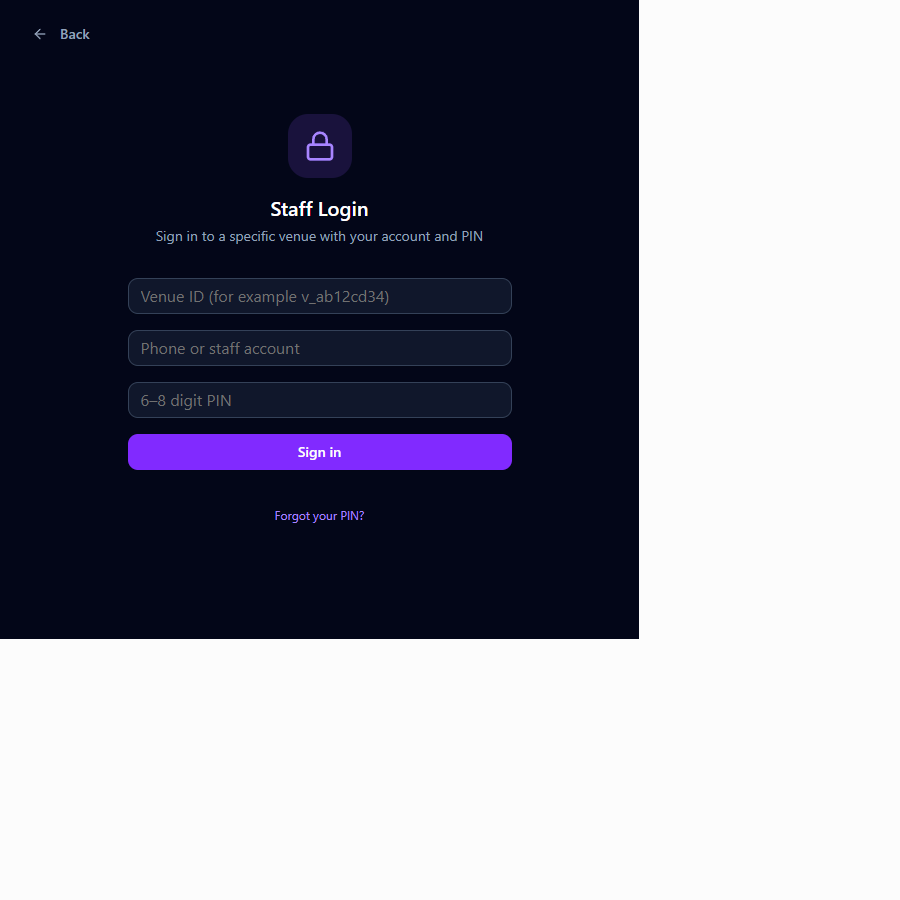
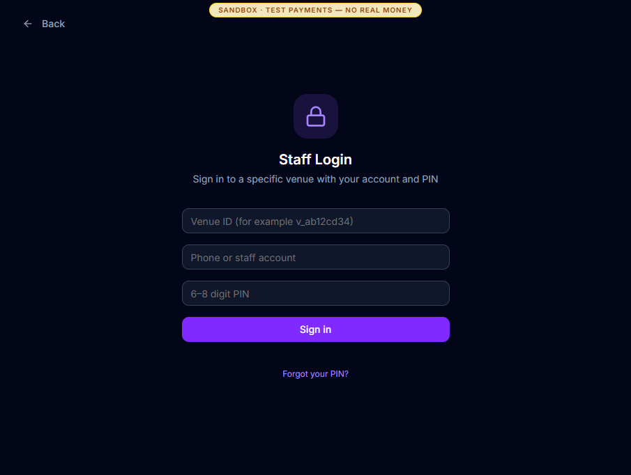
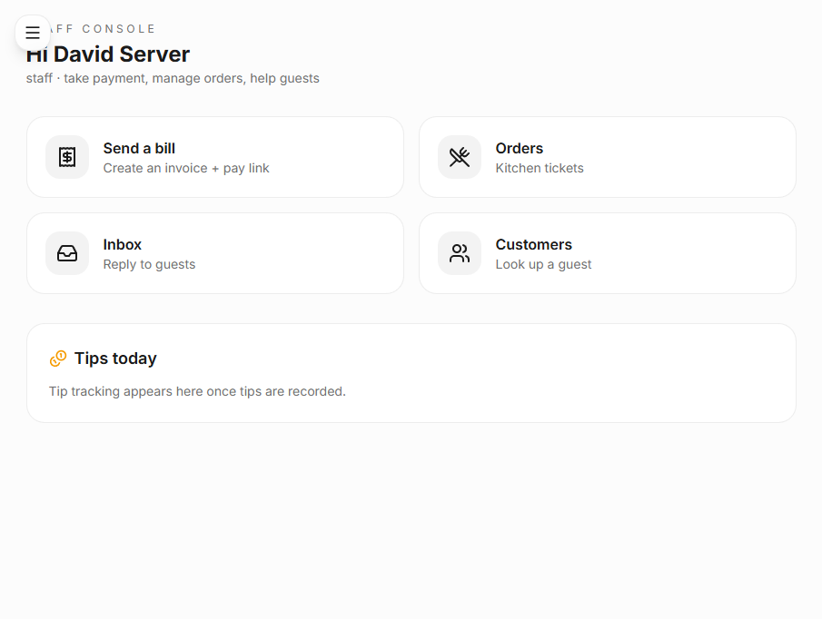
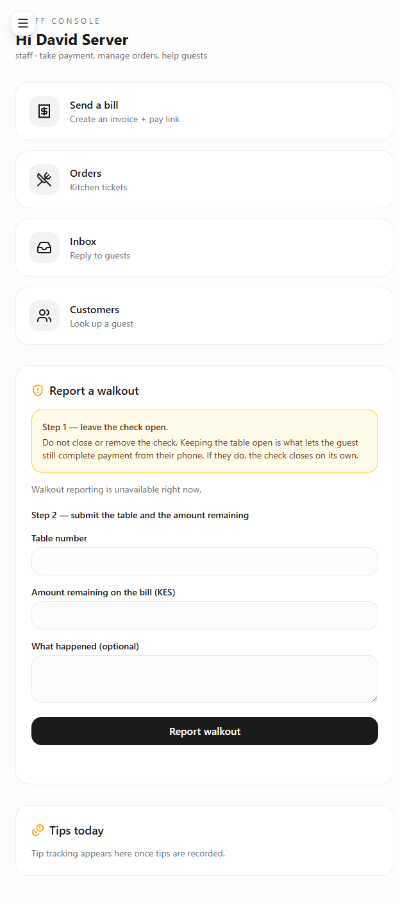

# David: server and floor staff walkthrough

**Goal:** sign in for a specific venue, follow assigned tables, help guests,
handle floor exceptions and see personal earnings.

**Status:** the deployed authentication handoff is **verified end to end**. The
remaining shift, alert and walkout gaps are listed separately below.

## 1. Current source login contract

**Current local source route:** `/staff-login`

The checked-out source requires three venue-scoped fields:

1. Venue ID.
2. Phone or staff account.
3. A six-to-eight-digit manager-issued PIN.

On success, the server is expected to mint a staff JWT carrying `venue` and
`staff_id`, then route David to `/staff-console`.

## 2. The live sandbox now matches

**Live sandbox route:** `/staff-login`

The sandbox database now has migration 58 and the deployed form asks for the same
three venue-scoped credentials. The legacy keypad and `Demo PIN: 1234` are no
longer present.

Amina rotated **David Server** to a fresh six-digit PIN from User management.
`POST /api/staff/<staff-id>/pin/reset` returned `200`, stored a salted scrypt
hash, cleared the lockout counters and incremented the credential version.

## 3. Staff console destination

**Route:** `/staff-console`

This is the deployed console after David submitted the live sandbox form. The
issued JWT was verified to contain:

- `role: staff`.
- Venue `v_4027243a`.
- David's server-side `staff_id`.
- Credential version `2`.
- A four-hour lifetime.

A subsequent manager PIN rotation revoked that JWT immediately; the same token
then received `401` from a protected staff endpoint.

The console provides four fast actions:

- Send a bill or pay link.
- Open kitchen orders.
- Reply in the guest inbox.
- Look up a customer.

The earlier QR order did not carry David's `staff_id`, so its KES 55 tip remains
unassigned and does not appear as David's personal earnings.

## 4. Current source exception flow

**Current local source route:** `/staff-console`

The current source adds a guided walkout report:

1. Leave the check open so the guest can still pay.
2. Enter the table and amount remaining.
3. Optionally record what happened.
4. Submit the incident without moving money or closing the check.

The screenshot intentionally shows `Walkout reporting is unavailable right now`
because the local app had no authenticated database session. This is the real
failure state for this run.

The same current source also contains table subscriptions, per-alert preferences,
table payment actions and a personal earnings panel. Those newer operational APIs
were deliberately not bundled into the narrow authentication release.

## End state

David can now be provisioned, receive a manager-issued PIN, authenticate to one
specific venue and reach the real staff console. Credential rotation also revokes
his existing sessions. A full clock-in-to-clock-out shift is still not available
on the deployed console.

## Remaining staff-flow work

1. Add a staff-visible clock-in/out control. The current console has none.
2. Assign `staff_id` when a table or QR order belongs to a server so tips,
   reviews and revenue do not remain unassigned.
3. Deploy and verify the current `/api/staff-alerts`, `/api/tips/me`, table payment and
   walkout APIs with a real staff JWT.
4. Add an explicit staff sign-out and readable notification feed.
