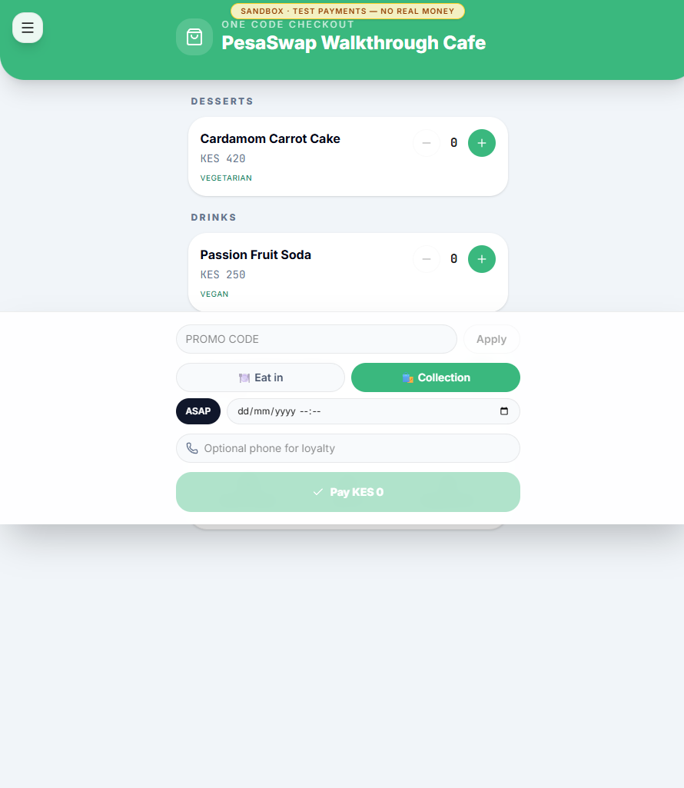
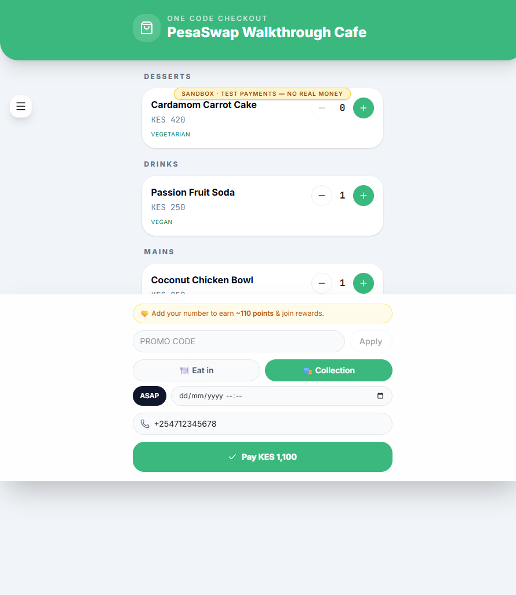
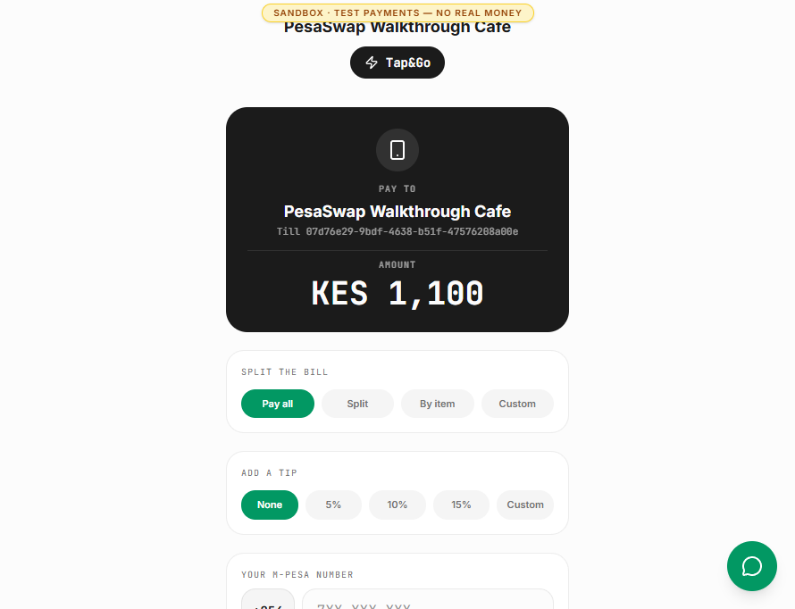
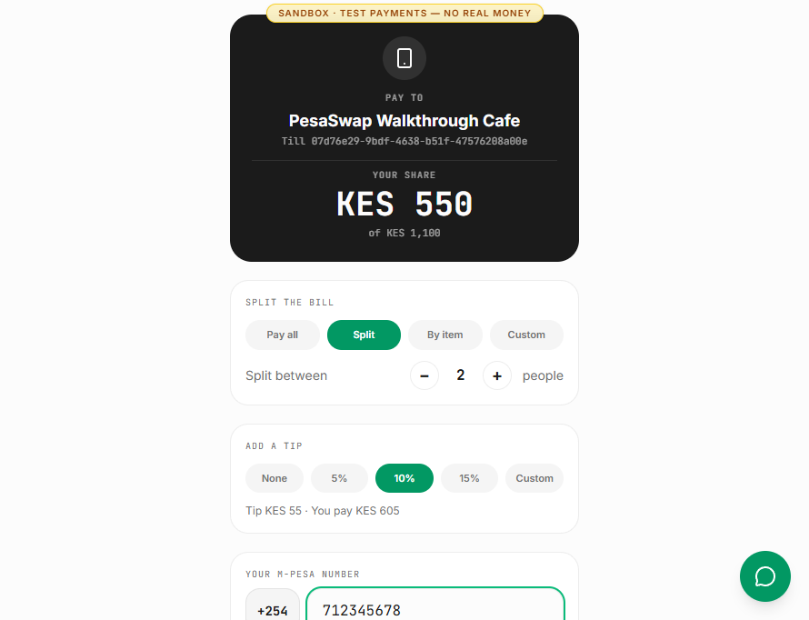
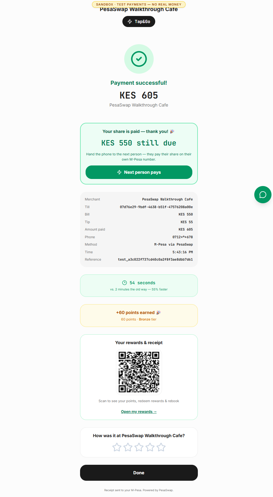
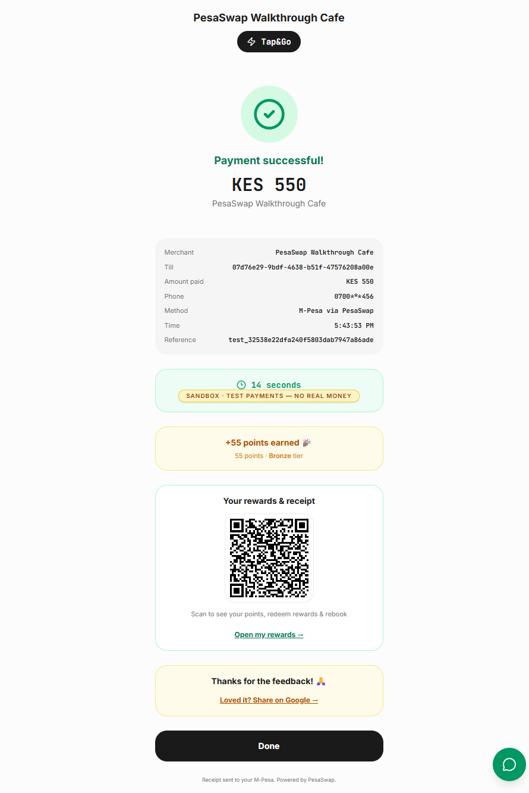
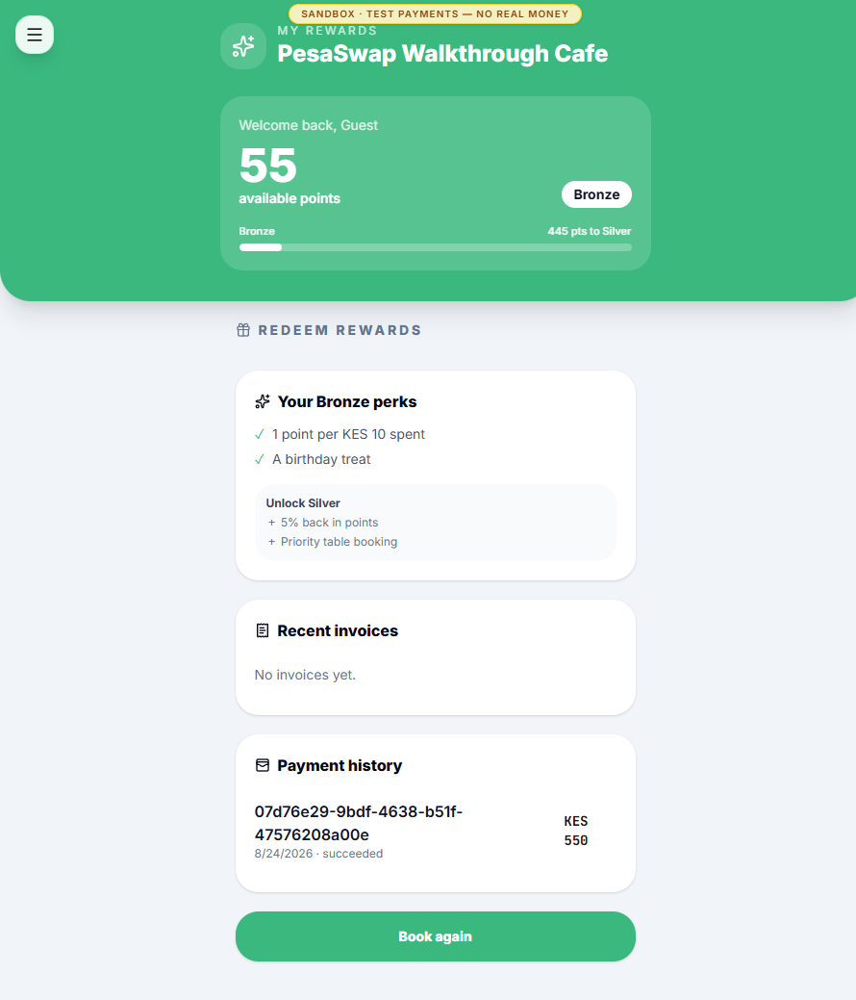

# James: guest and customer walkthrough

**Goal:** scan once, order without an app, split and tip, pay by M-Pesa, leave a
review and retain a receipt/rewards identity.

**Evidence:** this journey completed in the live sandbox using the QR created in
Amina's walkthrough. Payment simulation was enabled; the order, payment ledger,
loyalty and accounting effects were still written by the real application.

## 1. Scan the venue QR

**Route:** `/q/<server-issued-code>`

James lands directly on the branded menu. No app install or account is required.
Items show price and dietary information, and the fixed checkout area exposes
promo, fulfilment, scheduling and optional loyalty phone controls.

The venue QR defaults to collection; a table QR would default to dine-in and
carry the table identity.

## 2. Build the order and choose fulfilment

James adds the Coconut Chicken Bowl and Passion Fruit Soda. The server-backed
basket is KES 1,100. Adding a phone is optional, but the UI previews the loyalty
earn and remembers the guest for the receipt/rewards handoff.

`Pay KES 1,100` creates the order first. The server resolves item IDs, prices and
availability; the browser does not submit an authoritative charge amount. The
server then issues a single-use `/pay?o=<token>` link.

## 3. Review the server-bound payment

The payment page resolves the merchant, till and KES 1,100 balance from the
order token. James can choose:

- Pay all.
- Split evenly.
- Split by item.
- Enter a custom share.

Tip choice and M-Pesa number remain on the same screen.

## 4. Split and tip

James selects a two-person split. His bill share is KES 550. A 10% tip adds KES
55, so his M-Pesa charge is KES 605. The tip sits on top of the bill and does not
reduce the order's remaining KES 550 balance.

In live mode, `Pay KES 605` sends an STK prompt to the entered phone. In this
sandbox it writes a simulated succeeded payment without moving real money.

## 5. Hand the remaining balance to the next guest

The success state says **KES 550 still due** and exposes `Next person pays`.
James can hand over the same phone, or the next diner can open the same order
token, then enter their own M-Pesa number. The order remains open until the full
bill, excluding tips, is covered.

The first success screen displayed `+60 points` on the KES 605 charge. That
appears to include the KES 55 tip even though the ledger contract excludes tips
from loyalty. This UI/ledger discrepancy needs correction.

## 6. Complete payment and review

The second guest pays the remaining KES 550. The order balance reaches zero and
the pay token closes. The screen shows a masked phone, payment reference, elapsed
time, 55 points and a five-star review prompt.

After five stars, the sandbox offers a Google search fallback. It does not carry
a prefilled star value into Google.

## 7. Keep the receipt and rewards identity

**Route:** `/me/<server-issued-token>`

The success screen issues a tokenized portal link and QR. The second guest's
portal shows:

- 55 available points and Bronze status.
- Progress to Silver.
- Current tier perks.
- The succeeded KES 550 payment.
- A `Book again` action.

The broader portal also supports rewards redemption, invoices, refund requests
and privacy requests when those records exist.

## End state

The KES 1,100 order is fully paid by two guests, the KES 55 gratuity remains
separate, loyalty is attached to each payer, a review is recorded and each guest
can retain a receipt/rewards link without creating a password.

## Observed gaps and UX notes

- QR-created orders did not carry a serving `staff_id`, so the tip was unassigned
  and the guest could not choose a named server.
- Public `/q/*` and `/me/*` pages inherit the unrelated wallet navigation shell
  on a full browser page. The screenshots focus on the guest surface, but the
  shell should be removed.
- The external card widget script did not resolve in this run. Only the M-Pesa
  sandbox path was verified.
- The first tipped share overstated loyalty points by apparently counting the
  tip. The second untipped share and portal both showed the expected 55 points.
- A high rating used a generic Google search fallback because no venue Place ID
  was configured. Google does not support pre-filling the star selection through
  a documented URL parameter.
