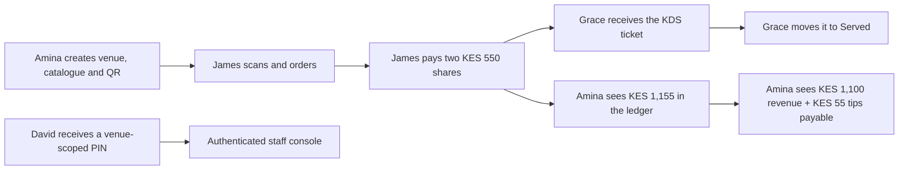

# PesaSwap role-by-role UI walkthroughs

Captured on **24 August 2026** against the current workspace and the isolated
Cloudflare sandbox.

These walkthroughs follow the four people named by the product specification and
Sunday-parity roadmap:

| Person | Role                      | Walkthrough                                                   | Verified finish                                        |
| ------ | ------------------------- | ------------------------------------------------------------- | ------------------------------------------------------ |
| Amina  | Merchant owner / HQ       | [Owner setup, trade and financial review](01-AMINA-OWNER.md)  | Payment ledger and balanced accounting entry           |
| Grace  | Venue and kitchen manager | [Service operations and close](02-GRACE-VENUE-MANAGER.md)     | Served order, settlement batch and Z-report            |
| David  | Server / floor staff      | [Staff shift workflow](03-DAVID-STAFF.md)                     | Venue-scoped PIN login and authenticated staff console |
| James  | Guest / customer          | [Scan, order, split, tip, pay and rewards](04-JAMES-GUEST.md) | Succeeded payment, review and rewards portal           |

## Evidence labels

- **Live sandbox** means the screen was exercised on
  `https://pesaswap-merchant-app-sandbox.pesaswap.workers.dev` against its
  separate database. `PAYMENTS_TEST_MODE=1`, so the payment ledger, order,
  loyalty and accounting writes are real application writes, but no money moved.
- **Current local source** means the screen was rendered from this workspace at
  `http://127.0.0.1:8080`. It is used where the checked-out source is ahead of the
  deployed sandbox.
- **Blocked** means a required transition could not be completed in the UI. The
  exact failed handoff is shown rather than replaced with a mock success screen.

## One transaction across all four people

The walkthroughs deliberately share one disposable venue and transaction so the
handoffs can be followed across roles:

The basket was:

| Item                 |        Amount |
| -------------------- | ------------: |
| Coconut Chicken Bowl |       KES 850 |
| Passion Fruit Soda   |       KES 250 |
| **Bill**             | **KES 1,100** |
| First guest tip      |        KES 55 |
| **Total captured**   | **KES 1,155** |

The first guest paid a KES 550 share plus a 10% tip (KES 605). The second guest
paid the remaining KES 550. Grace then completed the same order in the KDS, and
Amina reviewed the resulting ledger and journal entries.

## Cross-cutting findings

1. The guest and manager journeys are the strongest end-to-end flows today.
2. Sandbox staff authentication now matches the secure source contract: venue +
   account + a six-to-eight-digit PIN. Manager rotation, staff JWT issuance and
   credential-version session revocation were verified live.
3. Public guest routes currently inherit the unrelated wallet shell on a full
   page. The screenshots crop to the guest surface, but the shell is visible in
   the browser and should be removed from `/q/*` and `/me/*`.
4. Dashboard overview cards and onboarding progress mix browser snapshot state
   with server-backed state. The payment ledger and accounting pages were the
   reliable financial views in this run.
5. `/dashboard/walkouts` returned `Not Found` in the deployed sandbox even though
   the route exists in the current workspace.
6. Settlement is an application-calculated batch. It is not evidence of a bank
   statement import, provider payout match or the roadmap's full End of Service
   and Gap Assistant flow.
